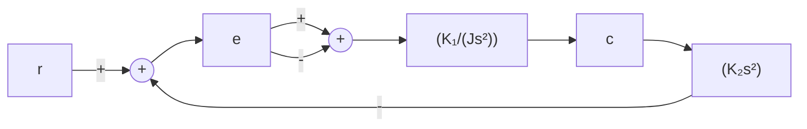
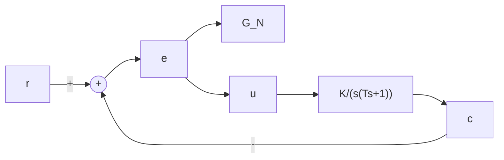

# 习题

8-1 某线性系统的结构图如图 8-76 所示, 试分别绘制下列三种情况时, 变量 e 的相轨迹, 并根据相轨迹分别作出相应的 $e(t)$ 曲线。

flowchart

图 8-76 题 8-1 的线性系统结构图

(1) $J = 1, K_{1} = 1, K_{2} = 2$ ，初始条件 $e(0) = 3, \dot{e}(0) = 0; e(0) = 1, \dot{e}(0) = -2.5$ ;  
(2) $J = 1, K_{1} = 1, K_{2} = 0.5$ ，初始条件 $e(0) = 3, \dot{e}(0) = 0; e(0) = -3, \dot{e}(0) = 0$ ;

(3) $J = 1, K_{1} = 1, K_{2} = 0$ ，初始条件 $e(0) = 1, \dot{e}(0) = 1; e(0) = 0, \dot{e}(0) = 2$ 。

8-2 设一阶非线性系统的微分方程为

$$\dot {x} = - x + x ^ {3}$$

试确定系统有几个平衡状态，分析各平衡状态的稳定性，并作出系统的相轨迹。

8-3 试确定下列方程的奇点及其类型,并用等倾线法或 MATLAB 法绘制它们的相平面图:

(1) $\ddot{x} + \dot{x} + |x| = 0;$   
(2) $\ddot{x} + x + \text{sign}\dot{x} = 0;$   
(3) $\ddot{x} + \sin x = 0;$   
(4) $\ddot{x} + |x| = 0$ ;

(5) $\left\{ \begin{array}{l} \dot{x}_1 = x_1 + x_2, \\ \dot{x}_2 = 2x_1 + x_2. \end{array} \right.$

8-4 若非线性系统的微分方程为

(1) $\ddot{x} + (3\dot{x} - 0.5)\dot{x} + x + x^2 = 0;$   
(2) $\ddot{x} + x\dot{x} + x = 0;$   
(3) $\ddot{x} + \dot{x}^2 + x = 0$ 。

试求系统的奇点，并概略绘制奇点附近的相轨迹。

8-5 非线性系统的结构图如图 8-77 所示, 系统开始是静止的, 输入信号 $r(t) = 4 \cdot 1(t)$ , 试写出开关线方程, 确定奇点的位置和类型, 作出该系统的相平面图, 并分析系统的运动特点。

flowchart

图 8-77 题 8-5 的非线性系统结构图

8-6 变增益控制系统的结构图及其中非线性元件 $G_{N}$ 的输入输出特性如图8-78所示，设系统开始处于零初始状态，若输入信号 $r(t) = R \cdot 1(t)$ ，且 $R > e_0; kK < \frac{1}{4T} < K$ ，试绘出系统的相平面图，分析采用变增益放大器对系统性能的影响。已知系统参数： $k = 0.1, e_0 = 0.6, K = 5, T = 0.49$ 。

flowchart

text_image

u
k
-e₀
0
e₀
e
(b)

图 8-78 题 8-6 具有非线性放大器的系统

8-7 图 8-79 为一带有库仑摩擦的二阶系统,试用相平面法讨论库仑摩擦对系统单位阶跃响应的影响。

8-8 设非线性系统如图 8-80 所示, 输入为单位斜坡函数。试在 e-ê 平面上绘制相轨迹。
