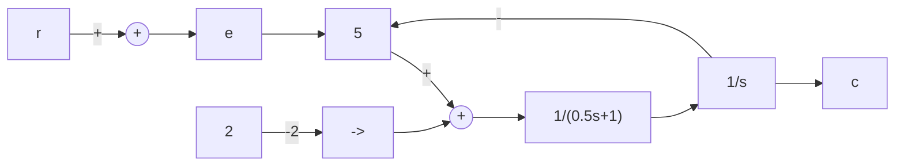
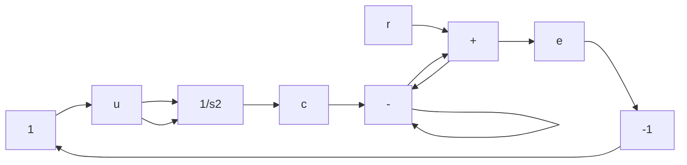
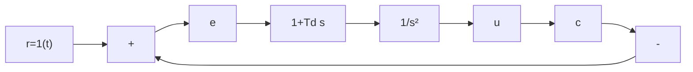

<details>
<summary>flowchart</summary>


</details>

图 8-79 题 8-7 有库仑摩擦的二阶系统


<details>
<summary>flowchart</summary>


</details>

图 8-80 题 8-8 的非线性系统

8-9 设非线性系统如图 8-81 所示, 其中 M=1, T=1。若输出为零初始条件, 输入 $r(t)=1(t)$ , 要求:


<details>
<summary>flowchart</summary>

```mermaid
graph LR
    r --> +
    + --> e --> 5 --> |M -0.5| A["0.5"]
    A --> u --> |1/(s(Ts+1))| c
    c --> -
    - --> +
    + --> -
    - --> -
    - --> -
    - --> -
    - --> -
    - --> -
    - --> -
    - --> -
    - --> -
    - --> -
    - --> -
    - --> -
    - --> -
    - --> -
    - --> -
    - --> -
    - --> -
    - --> -
    - --> -
    - --> -
    - --> -
    - --> -
    - --> -
    - --> -
    - --> -
    - --> -
    -
```
</details>

图 8-81 题 8-9 的非线性系统

(1) 在 $e \dot{e}$ 平面上画出相轨迹；  
(2) 判断该系统是否稳定, 最大稳态误差是多少;  
(3) 绘出 $e(t)$ 及 $c(t)$ 的时间响应大致波形。

8-10 已知具有理想继电器的非线性系统如图 8-82 所示,试用相平面法分析:


<details>
<summary>flowchart</summary>


</details>

图 8-82 题 8-10 具有理想继电器的非线性系统

(1) $T_{d}=0$ 时系统的运动；  
(2) $T_{d}=0.5$ 时系统的运动，并说明比例微分控制对改善系统性能的作用；  
(3) $T_{d}=2$ ，并考虑实际继电器有延迟时系统的运动。

8-11 非线性系统的结构图如图 8-83 所示, 图中 a=0.5, K=8, T=0.5, $K_{t}=0.5$ , 要求:


<details>
<summary>flowchart</summary>


</details>

图 8-83 题 8-11 的非线性系统

(1) 当开关断开时, 绘制初始条件为 $e(0)=2$ , $\dot{e}(0)=0$ 的相轨迹;  
(2) 当开关闭合时, 绘制相同初始条件下的相轨迹, 并说明测速反馈的作用。

8-12 设三个非线性系统的非线性环节一样,其线性部分分别为
