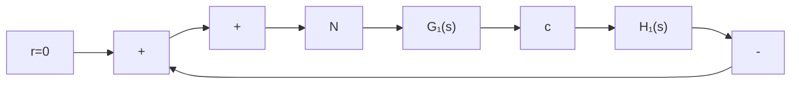
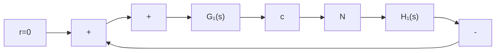
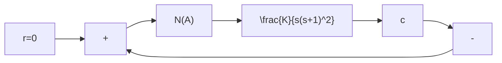

(1) $G(s)=\frac{1}{s(0.1s+1)}$ ;   
(2) $G(s) = \frac{2}{s(s + 1)};$   
(3) $G(s) = \frac{2(1.5s + 1)}{s(s + 1)(0.1s + 1)}$ .

用描述函数法分析时,哪个系统分析的准确度高?

8-13 试推导下列非线性特性的描述函数：

(1) 变增益特性(见表 8-1 中第九项);  
(2) 具有死区的继电特性(见表 8-1 中第二项);  
(3) $y=x^{3}$ 。

8-14 将图 8-84 所示非线性系统简化成典型结构图形式，并写出线性部分的传递函数。

flowchart

(a)

flowchart

(b)   
图 8-84 题 8-14 的非线性系统结构图

8-15 根据已知非线性特性的描述函数求图 8-85 所示各种非线性特性的描述函数。

text_image

-a
0 a
x
y
K

(a)

text_image

y
2M
M
0 a b x

(b)

flowchart

(c)   
图 8-85 题 8-15 的非线性特性

8-16 某单位反馈系统, 其前向通路中有一描述函数 $N(A) = \mathrm{e}^{-\mathrm{j}\frac{\pi}{4}} / A$ 的非线性元件, 线性部分的传递函数为 $G(s) = 15 / s(0.5s + 1)$ , 试用描述函数法确定系统是否存在自振? 若有, 参数是多少?  
8-17 已知非线性系统的结构图如图 8-86 所示, 图中非线性环节的描述函数 $N(A) = \frac{A + 6}{A + 2}$ ( $A > 0$ ), 试用描述函数法确定:

flowchart

图 8-86 题 8-17 的非线性系统

(1) 使该非线性系统稳定、不稳定以及产生周期运动时，线性部分的 K 值范围；  
(2) 判断周期运动的稳定性, 并计算稳定周期运动的振幅和频率。

8-18 非线性系统如图 8-87 所示,试用描述函数法分析周期运动的稳定性,并确定系统输出信号振荡的振幅和频率。

flowchart

