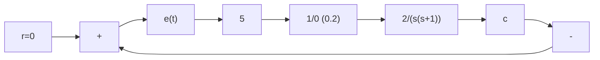
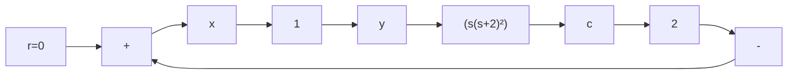
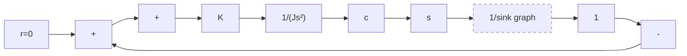
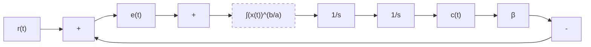
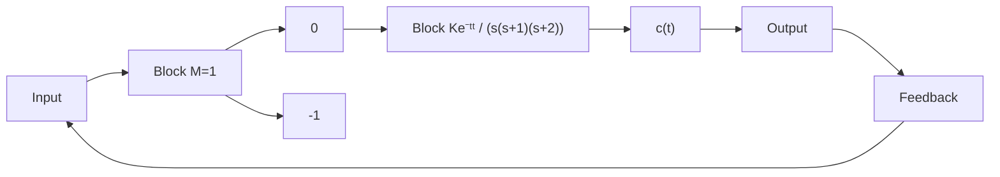

图 8-87 题 8-18 的非线性系统

8-19 试用描述函数法说明图 8-88 所示系统必然存在自振，并确定 c 的自振振幅和频率，画出 c, x, y 的稳态波形。

8-20 试用描述函数法和相平面法分析图 8-89 所示非线性系统的稳定性及自振。

8-21 已知非线性系统的输入和输出关系式

$$\ddot {y} + a f (\ddot {y}, \dot {y}, y) = \ddot {u} + b g (\dot {u}, u)$$

试求伪线性系统的结构及实现形式。

flowchart

图 8-88 题 8-19 的非线性系统

flowchart

图 8-89 题 8-20 的非线性系统

8-22 已知带速度反馈的非线性系统如图 8-90 所示。系统原来处于静止状态，且 $0 < \beta < 1$ ，输入 $r(t) = -R \cdot 1(t) (R > a)$ ，试分别画出有速度反馈和无速度反馈时的系统相轨迹。

flowchart

图 8-90 非线性系统

8-23 非线性系统如图 8-91 所示, 其中非线性环节的描述函数 $N(A)=\frac{4M}{\pi A}$ 。试问:

flowchart

图 8-91 非线性系统

(1) 当 $\tau=0$ 时, 系统受扰动后的稳定运动状态呈现什么形式?  
(2) 当 $\tau \neq 0$ 时, 要使系统产生频率 $\omega = 1$ , 幅值 $A = 2$ 的自振, $\tau$ 与 $K$ 应取何值?

8-24 若要求图 8-92 所示非线性系统输出量 c 的自振振幅 $A_{c}=0.1$ ，角频率 $\omega=10$ ，试确定参数 T 及 K 的数值 (T, K 均大于零)。

flowchart

