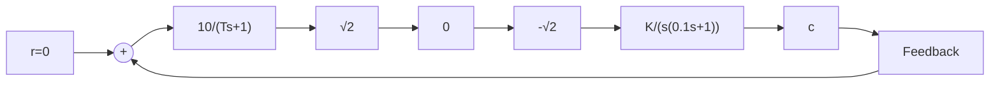

```mermaid
graph LR
    A["r=0"] --> B((+))
    B --> C["10/(Ts+1)"]
    C --> D["√2"]
    D --> E["0"]
    E --> F["-√2"]
    F --> G["K/(s(0.1s+1))"]
    G --> H["c"]
    H --> I["Feedback"]
    I --> B
```

图 8-92 非线性系统结构图

8-25 设非线性系统如图 8-93 所示, 其中参数 $K_{1}, K_{2}, T_{1}, T_{2}, M$ 均为正。试确定:

flowchart

```mermaid
graph LR
    A["Input"] --> B["Block M with horizontal line 0 and vertical line -M"]
    B --> C["Block -"]
    C --> D["Block K1 with input s(T1s+1)(T2s+1)"]
    D --> E["Output c(t)"]
    E --> F["Feedback to Block"]
    F --> B
```

图 8-93 非线性系统

(1) 系统发生自振时, 各参数应满足的条件;  
(2) 自振频率和振幅。
