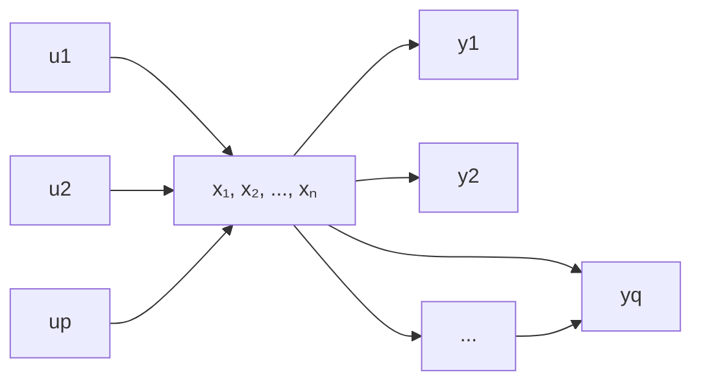

# 1. 系统数学描述的两种基本类型

这里所谓的系统是指由一些相互制约的部分构成的整体,它可能是一个由反馈闭合的整体,也可能是某一控制装置或被控对象。本章所研究的系统均假定具有若干的输入端和输出端,如图9-1所示。图中方块以外的部分为系统环境,环境对系统的作用为系统输入,系统对环境的作用为系统输出,二者分别用向量 $u=[u_{1},u_{2},\cdots,u_{p}]^{T}$ 和 $y=[y_{1},y_{2},\cdots,y_{q}]^{T}$ 表示,它们均为系统的外部变量。描述系统内部每个时刻所处状况的变量为系统的内部变量,以向量 $x=[x_{1},x_{2},\cdots,x_{n}]^{T}$ 表示。系统的数学描述是反映系统变量间因果关系和变换关系的一种数学模型。

系统的数学描述通常有两种基本类型。一种是系统的外部描述，即输入-输出描述。这种描述将系统看做一个“黑箱”，只是反映系统外部变量间即输入-输出间的因果关系，而不去表征系统的内部结构和内部变量。系统描述的另一种类型是内部描述，即状态空间描述。这种描述是基于系统内部

flowchart

图 9-1 系统的方块图表示

结构分析的一类数学模型,通常由两个数学方程组成:一个是反映系统内部变量 $x=[x_{1},x_{2},\cdots,x_{n}]^{T}$ 和输入变量 $u=[u_{1},u_{2},\cdots,u_{p}]^{T}$ 间因果关系的数学表达式,常具有微分方程或差分方程的形式,称为状态方程;另一个是表征系统内部变量 $x=[x_{1},x_{2},\cdots,x_{n}]^{T}$ 及输入变量 $u=[u_{1},u_{2},\cdots,u_{p}]^{T}$ 和输出变量 $y=[y_{1},y_{2},\cdots,y_{q}]^{T}$ 间转换关系的数学表达式,具有代数方程的形式,称为输出方程。外部描述仅描述系统的外部特性,不能反映系统的内部结构特性,而具有完全不同内部结构的两个系统也可能具有相同的外部特性,因而外部描述通常只是对系统的一种不完全的描述。内部描述则是对系统的一种完全的描述,它能完全表征系统的所有动力学特征。仅当在系统具有一定属性的条件下,两种描述才具有等价关系。
