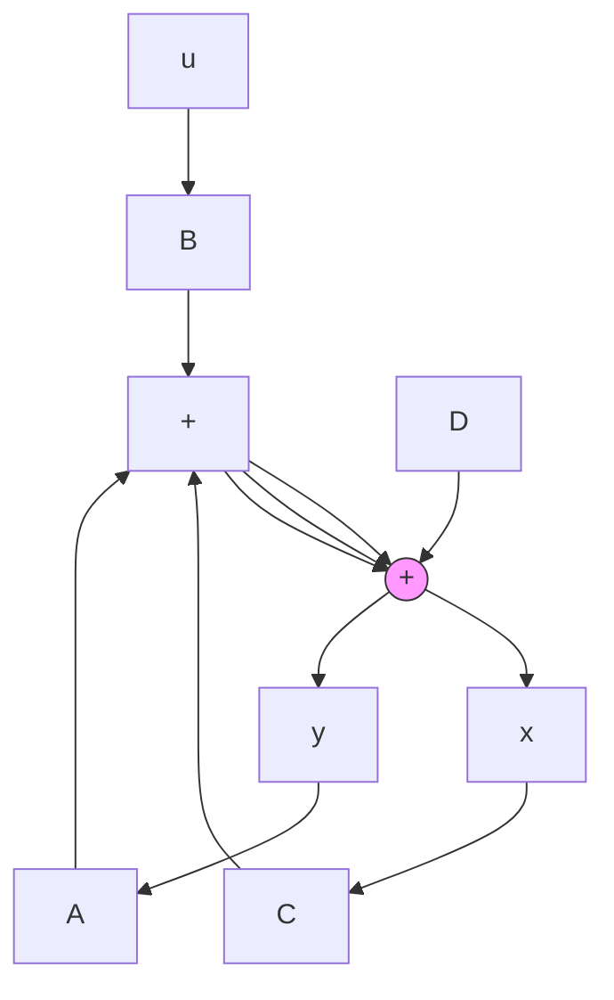
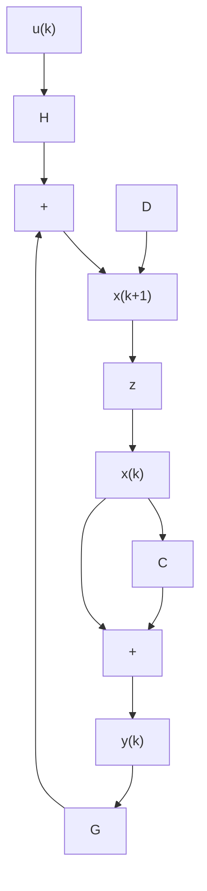

当输出方程中 $D \equiv 0$ 时，系统称为绝对固有系统，否则称为固有系统。为书写方便，常把固有系统(9-3)或(9-4)简记为系统 $(A, B, C, D)$ 或系统 $(G, H, C, D)$ ，而记相应的绝对固有系统为系统 $(A, B, C)$ 或系统 $(G, H, C)$ 。

线性系统的结构图 线性系统的状态空间表达式常用结构图表示。线性连续时间系统(9-3)的结构图如图9-2所示，线性离散时间系统(9-4)的结构图如图9-3所示。结构图中I为 $n\times n$ 单位矩阵，s是拉普拉斯算子， $z^{-1}$ 为单位延时算子，s和z均为标量。每一方块的输入-输出关系规定为

$$\text { 输出向量 } = (\text { 方块所示矩阵 }) \times (\text { 输入向量 })$$

应注意到在向量、矩阵的乘法运算中，相乘顺序不允许任意颠倒。

flowchart

图 9-2 线性连续时间系统结构图

flowchart

图 9-3 线性离散时间系统结构图
