# (2) 由系统微分方程建立状态空间表达式

按系统输入量中是否含有导数项来分别研究。

1) 系统输入量中不含导数项。这种单输入-单输出线性定常连续系统微分方程的一般形式为

$$y ^ {(n)} + a _ {n - 1} y ^ {(n - 1)} + a _ {n - 2} y ^ {(n - 2)} + \dots + a _ {1} \dot {y} + a _ {0} y = \beta_ {0} u \tag {9-5}$$

式中，y,u 分别为系统的输出、输入量； $a_{0},a_{1},\cdots,a_{n-1},\beta_{0}$ 是由系统特性确定的常系数。由于给定 n 个初值 $y(0),\dot{y}(0),\cdots,y^{n-1}(0)$ 及 $t\geqslant0$ 的 $u(t)$ 时，可唯一确定 t>0 时系统的行为，可选取 n 个状态变量为 $x_{1}=y,x_{2}=\dot{y},\cdots,x_{n}=y^{(n-1)}$ ，故式(9-5)可化为

$$
\left. \begin{array}{l} \dot {x} _ {1} = x _ {2} \\ \dot {x} _ {2} = x _ {3} \\ \vdots \\ \dot {x} _ {n - 1} = x _ {n} \\ \dot {x} _ {n} = - a _ {0} x _ {1} - a _ {1} x _ {2} - \dots - a _ {n - 1} x _ {n} + \beta_ {0} u \\ y = x _ {1} \end{array} \right\} \tag {9-6}
$$

其向量-矩阵形式为

$$\dot {\boldsymbol {x}} = \boldsymbol {A} \boldsymbol {x} + \boldsymbol {b} \boldsymbol {u} \tag {9-7}y = c x$$

式中

$$
\boldsymbol {x} = \left[ \begin{array}{c} x _ {1} \\ x _ {2} \\ \vdots \\ x _ {n - 1} \\ x _ {n} \end{array} \right], \quad \boldsymbol {A} = \left[ \begin{array}{c c c c c} 0 & 1 & 0 & \dots & 0 \\ 0 & 0 & 1 & \dots & 0 \\ \vdots & \vdots & \vdots & & \vdots \\ 0 & 0 & 0 & \dots & 1 \\ - a _ {0} & - a _ {1} & - a _ {2} & \dots & - a _ {n - 1} \end{array} \right], \quad \boldsymbol {b} = \left[ \begin{array}{c} 0 \\ 0 \\ \vdots \\ 0 \\ \beta_ {0} \end{array} \right]

\boldsymbol {c} = \left[ \begin{array}{l l l l} 1 & 0 & \dots & 0 \end{array} \right]
$$

按式(9-6)绘制的结构图称为状态变量图,如图9-5所示。每个积分器的输出都是对应的状态变量,状态方程由各积分器的输入-输出关系确定,输出方程在输出端获得。

```mermaid
graph TD
    A["u"] --> B["β₀"]
    B --> C["+"]
    C --> D["1/s"]
    D --> E["xₙ"]
    E --> F["1/s"]
    F --> G["xₙ₋₁"]
    G --> H["..."]
    H --> I["x₄"]
    I --> J["1/s"]
    J --> K["x₃"]
    K --> L["1/s"]
    L --> M["x₂"]
    M --> N["1/s"]
    N --> O["x₁=y"]
    O --> P["a₀"]
    P --> Q["+"]
    Q --> R["..."]
    R --> S["+"]
    S --> T["+"]
    T --> U["+"]
    U --> V["+"]
    V --> W["+"]
    W --> X["+"]
    X --> Y["+"]
    Y --> Z["+"]
    Z --> AA["+"]
    AA --> AB["+"]
    AB --> AC["+"]
    AC --> AD["+"]
    AD --> AE["+"]
    AE --> AF["+"]
    AF --> AG["+"]
    AG --> AH["+"]
    AH --> AI["+"]
    AI --> AJ["+"]
    AJ --> AK["+"]
    AK --> AL["+"]
    AL --> AM["+"]
    AM --> AN["+"]
    AN --> AO["+"]
    AO --> AP["+"]
    AP --> AQ["+"]
    AQ --> AR["+"]
    AR --> AS["+"]
    AS --> AT["+"]
    AT --> AU["+"]
    AU --> AV["+"]
    AV --> AW["+"]
    AW --> AX["+"]
```

flowchart

图 9-5 系统结构图

2) 系统输入量中含有导数项。这种单输入-单输出线性定常连续系统微分方程的一般形式为
