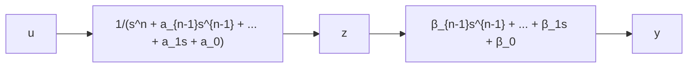

$$
\left[ \begin{array}{l} \dot {x} _ {1} \\ \dot {x} _ {2} \end{array} \right] = \left[ \begin{array}{c c} 0 & 1 \\ - \omega^ {2} & - 2 \zeta \omega \end{array} \right] \left[ \begin{array}{l} x _ {1} \\ x _ {2} \end{array} \right] + \left[ \begin{array}{c c} T \\ 1 - 2 \zeta \omega T \end{array} \right] u, \quad y = [ 1 0 ] \left[ \begin{array}{l} x _ {1} \\ x _ {2} \end{array} \right]
$$

(3) 由系统传递函数建立状态空间表达式

式(9-8)所对应的系统传递函数为

$$G (s) = \frac {Y (s)}{U (s)} = \frac {b _ {n} s ^ {n} + b _ {n - 1} s ^ {n - 1} + b _ {n - 2} s ^ {n - 2} + \cdots + b _ {1} s + b _ {0}}{s ^ {n} + a _ {n - 1} s ^ {n - 1} + a _ {n - 2} s ^ {n - 2} + \cdots + a _ {1} s + a _ {0}} \tag {9-14}$$

应用综合除法有

$$G (s) = b _ {n} + \frac {\beta_ {n - 1} s ^ {n - 1} + \beta_ {n - 2} s ^ {n - 2} + \cdots + \beta_ {1} s + \beta_ {0}}{s ^ {n} + a _ {n - 1} s ^ {n - 1} + a _ {n - 2} s ^ {n - 2} + \cdots + a _ {1} s + a _ {0}} \triangleq b _ {n} + \frac {N (s)}{D (s)} \tag {9-15}$$

式中， $b_{n}$ 是直接联系输入与输出量的前馈系数，当 $G(s)$ 的分母次数大于分子次数时， $b_{n}=0$ ， $\frac{N(s)}{D(s)}$ 是严格有理真分式，其系数由综合除法得到为

$$
\begin{array}{l} \beta_ {0} = b _ {0} - a _ {0} b _ {n} \\ \beta_ {1} = b _ {1} - a _ {1} b _ {n} \\ \begin{array}{c} \bullet \\ \vdots \\ \bullet \end{array} \\ \beta_ {n - 2} = b _ {n - 2} - a _ {n - 2} b _ {n} \\ \beta_ {n - 1} = b _ {n - 1} - a _ {n - 1} b _ {n} \\ \end{array}
$$

下面介绍由 $\frac{N(s)}{D(s)}$ 导出几种标准形式动态方程的方法。

1) $\frac{N(s)}{D(s)}$ 串联分解的情况。将 $\frac{N(s)}{D(s)}$ 分解为两部分相串联，如图9-7所示， $z$ 为中间变量， $z, y$ 应满足

$$z ^ {(n)} + a _ {n - 1} z ^ {(n - 1)} + \dots + a _ {1} \dot {z} + a _ {0} z = uy = \beta_ {n - 1} z ^ {(n - 1)} + \dots + \beta_ {1} \dot {z} + \beta_ {0} z$$

flowchart

图9-7 $\frac{N(s)}{D(s)}$ 的串联分解

选取状态变量

$$x _ {1} = z, \quad x _ {2} = \dot {z}, \quad x _ {3} = \ddot {z}, \quad \dots , \quad x _ {n} = z ^ {(n - 1)}$$

则状态方程为

$$
\begin{array}{l} \dot {x} _ {1} = x _ {2} \\ \dot {x} _ {2} = x _ {3} \\ \begin{array}{c} \bullet \\ \vdots \\ \bullet \end{array} \\ \dot {x} _ {n} = - a _ {0} z - a _ {1} \dot {z} - \dots - a _ {n - 1} z ^ {(n - 1)} + u \\ = - a _ {0} x _ {1} - a _ {1} x _ {2} - \dots - a _ {n - 1} x _ {n} + u \\ \end{array}
$$

输出方程为

$$y = - \beta_ {0} x _ {1} - \beta_ {1} x _ {2} - \dots - \beta_ {n - 1} x _ {n}$$

其向量-矩阵形式的动态方程为

$$\dot {\pmb {x}} = \pmb {A} \pmb {x} + \pmb {b} \pmb {u}, \qquad y = \pmb {c x} \tag {9-16}$$

式中
