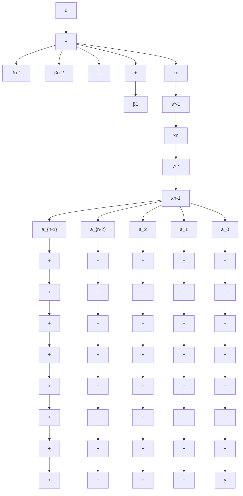

$$
\mathbf {A} = \left[ \begin{array}{c c c c c} 0 & 1 & 0 & \dots & 0 \\ 0 & 0 & 1 & \dots & 0 \\ \vdots & \vdots & \vdots & & \vdots \\ 0 & 0 & 0 & \dots & 1 \\ - a _ {0} & - a _ {1} & - a _ {2} & \dots & - a _ {n - 1} \end{array} \right], \quad \mathbf {b} = \left[ \begin{array}{l} 0 \\ 0 \\ \vdots \\ 0 \\ 1 \end{array} \right], \quad \mathbf {c} = [ \beta_ {0} \quad \beta_ {1} \quad \dots \quad \beta_ {n - 1} ]
$$

请读者注意 A, b 的形状特征, 这种 A 阵又称友矩阵, 若状态方程中的 A, b 具有这种形式, 则称为可控标准型。当 $\beta_{1} = \beta_{2} = \cdots = \beta_{n-1} = 0$ 时, A, b 的形式不变, $c = [\beta_{0} \quad 0 \quad \cdots \quad 0]$ 。

因而，当 $G(s) = b_{n} + \frac{N(s)}{D(s)}$ 时， $\pmb{A},\pmb{b}$ 不变， $y = c\pmb{x} + b_n u$ 。 $\frac{N(s)}{D(s)}$ 串联分解时的可控标准型状态变量图如图9-8所示。

flowchart

图9-8 $\frac{N(s)}{D(s)}$ 串联分解的可控标准型状态变量图

当 $b_{n} = 0$ 时，若按式(9-12)选取状态变量，则系统的 $\pmb{A},\pmb{b},\pmb{c}$ 矩阵为

$$
\mathbf {A} = \left[ \begin{array}{c c c c c} 0 & 0 & \dots & 0 & - a _ {0} \\ 1 & 0 & \dots & 0 & - a _ {1} \\ 0 & 1 & \dots & 0 & - a _ {2} \\ \vdots & \vdots & & \vdots & \vdots \\ 0 & 0 & \dots & 1 & - a _ {n - 1} \end{array} \right], \quad \mathbf {b} = \left[ \begin{array}{c} \beta_ {0} \\ \beta_ {1} \\ \beta_ {2} \\ \vdots \\ \beta_ {n - 1} \end{array} \right], \quad \mathbf {c} = [ 0 \quad \dots \quad 0 \quad 1 ]
$$

请注意 A, c 的形状特征, 此处 A 矩阵是友矩阵的转置。若动态方程中的 A, c 具有这种形式, 则称为可观测标准型。

由上可见，可控标准型与可观测标准型的各矩阵之间存在如下关系：

$$\boldsymbol {A} _ {c} = \boldsymbol {A} _ {o} ^ {\mathrm{T}}, \quad \boldsymbol {b} _ {c} = \boldsymbol {c} _ {o} ^ {\mathrm{T}}, \quad \boldsymbol {c} _ {c} = \boldsymbol {b} _ {o} ^ {\mathrm{T}} \tag {9-17}$$
