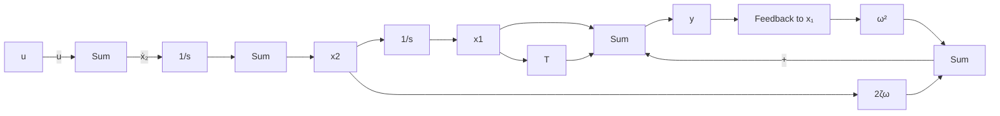
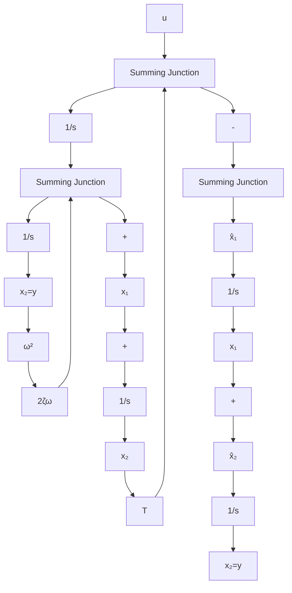

式中，下标 c 表示可控标准型；o 表示可观测标准型；T 为转置符号。式(9-17)所示关系称为对偶关系。关于系统的可控和可观测等概念，后面还要进行较详细的论述。

例 9-3 试列写例 9-2 所示系统的可控标准型、可观测标准型动态方程，并分别确定状态变量与输入、输出量的关系。

解 该系统的传递函数为

$$G (s) = \frac {Y (s)}{U (s)} = \frac {T s + 1}{s ^ {2} + 2 \zeta \omega s + \omega^ {2}}$$

可控标准型动态方程的各矩阵为

$$
\boldsymbol {x} _ {c} = \left[ \begin{array}{l} x _ {c 1} \\ x _ {c 2} \end{array} \right], \quad \boldsymbol {A} _ {c} = \left[ \begin{array}{l l} 0 & 1 \\ - \omega^ {2} & - 2 \zeta \omega \end{array} \right], \quad \boldsymbol {b} _ {c} = \left[ \begin{array}{l} 0 \\ 1 \end{array} \right], \quad \boldsymbol {c} _ {c} = [ 1 T ]
$$

由 $G(s)$ 串联分解并引入中间变量 $z$ 有

$$\ddot {z} + 2 \zeta \omega \dot {z} + \omega^ {2} z = uy = T \dot {z} + z$$

对 $y$ 求导数并考虑上述关系式则有

$$\dot {y} = T \ddot {z} + \dot {z} = (1 - 2 \zeta \omega T) \dot {z} - \omega^ {2} T z + T u$$

令 $x_{c1} = z, x_{c2} = \dot{z}$ , 可导出状态变量与输入、输出量的关系:

$$x _ {c 1} = \left[ - T \dot {y} + (1 - 2 \zeta \omega T) y + T ^ {2} u \right] / (1 - 2 \zeta \omega T + \omega^ {2} T ^ {2})x _ {c 2} = (\dot {y} + \omega^ {2} T y - T u) / (1 - 2 \zeta \omega T + \omega^ {2} T ^ {2})$$

可观测标准型动态方程各矩阵为

$$
\boldsymbol {x} _ {o} = \left[ \begin{array}{l} x _ {o 1} \\ x _ {o 2} \end{array} \right], \quad \boldsymbol {A} _ {o} = \left[ \begin{array}{l l} 0 & - \omega^ {2} \\ 1 & - 2 \zeta \omega \end{array} \right], \quad \boldsymbol {b} _ {o} = \left[ \begin{array}{l} 1 \\ T \end{array} \right], \quad \boldsymbol {c} _ {o} = [ 0 1 ]
$$

根据式(9-12)可以写出状态变量与输入、输出量的关系

$$x _ {o 1} = \dot {y} + 2 \zeta \omega y - T ux _ {o 2} = y$$

图 9-9 与图 9-10 分别示出了该系统可控标准型与可观测标准型的状态变量图。

flowchart

图 9-9 例 9-3 可控标准型状态变量图

flowchart

