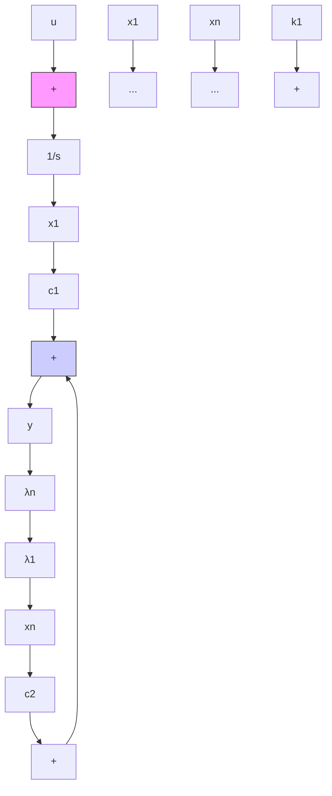
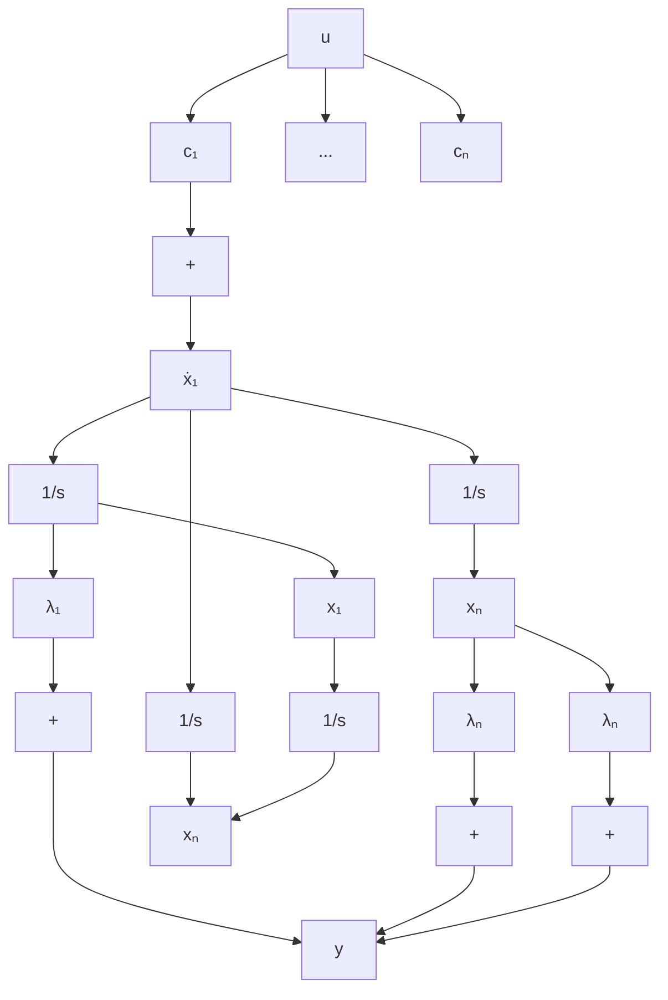

flowchart

(a)

flowchart

(b)   
图 9-11 对角型动态方程的状态变量图

3) $\frac{N(s)}{D(s)}$ 含重实极点时的情况。当传递函数除含单实极点之外还含有重实极点时，不仅可化为可控、可观测标准型，还可化为约当标准型动态方程，其 $\mathbf{A}$ 阵是一个含约当块的矩阵。设 $D(s)$ 可分解为

$$D (s) = (s - \lambda_ {1}) ^ {3} (s - \lambda_ {4}) \dots (s - \lambda_ {n})$$

式中， $\lambda_{1}$ 为三重实极点； $\lambda_{4},\cdots,\lambda_{n}$ 为单实极点，则传递函数可展成下列部分分式之和：

$$\frac {Y (s)}{U (s)} = \frac {N (s)}{D (s)} = \frac {c _ {1 1}}{(s - \lambda_ {1}) ^ {3}} + \frac {c _ {1 2}}{(s - \lambda_ {1}) ^ {2}} + \frac {c _ {1 3}}{(s - \lambda_ {1})} + \sum_ {i = 4} ^ {n} \frac {c _ {i}}{s - \lambda_ {i}}$$

其状态变量的选取方法与只含单实极点时相同，可分别得出向量-矩阵形式的动态方程：

$$
\left[ \begin{array}{c} \dot {x} _ {1 1} \\ \dot {x} _ {1 2} \\ \dot {x} _ {1 3} \\ \dots \\ \dot {x} _ {4} \\ \vdots \\ \dot {x} _ {n} \end{array} \right] = \left[ \begin{array}{c c c c c c c} \lambda_ {1} & 1 & & & & 0 \\ & \lambda_ {1} & 1 & & & \\ & & \lambda_ {1} & & & \\ \dots & \dots & \dots & & \lambda_ {4} & & \\ & 0 & & & & \ddots & \\ & & & & & & \lambda_ {n} \end{array} \right] \left[ \begin{array}{c} x _ {1 1} \\ x _ {1 2} \\ x _ {1 3} \\ \dots \\ x _ {4} \\ \vdots \\ x _ {n} \end{array} \right] + \left[ \begin{array}{c} 0 \\ 0 \\ 1 \\ \dots \\ 1 \\ \vdots \\ 1 \end{array} \right] u \tag {9-20}

y = \left[ \begin{array}{l l l l} c _ {1 1} & c _ {1 2} & c _ {1 3} & c _ {4} \dots c _ {n} \end{array} \right] x
