\left[ \begin{array}{c} \dot {x} _ {1 1} \\ \dot {x} _ {1 2} \\ \dot {x} _ {1 3} \\ \dots \\ \dot {x} _ {4} \\ \vdots \\ \dot {x} _ {n} \end{array} \right] = \left[ \begin{array}{c c c c c c c c} \lambda_ {1} & & & & & 0 & & \\ 1 & \lambda_ {1} & & \vdots & & & \\ & 1 & \lambda_ {1} & \vdots & & & \\ \dots & \dots & \dots & + & & & \\ & & & & \lambda_ {4} & & \\ & 0 & & & & \ddots & \\ & & & & & & \lambda_ {n} \end{array} \right] \left[ \begin{array}{c} x _ {1 1} \\ x _ {1 2} \\ x _ {1 3} \\ \dots \\ x _ {4} \\ \vdots \\ x _ {n} \end{array} \right] + \left[ \begin{array}{c} c _ {1 1} \\ c _ {1 2} \\ c _ {1 3} \\ \dots \\ c _ {4} \\ \vdots \\ c _ {n} \end{array} \right] u \tag {9-21}

y = \left[ \begin{array}{c c c c c c} 0 & 0 & 1 & 1 & \dots & 1 \end{array} \right] x
$$

其对应的状态变量图如图 9-12(a)，(b) 所示。式(9-20)与式(9-21)也存在对偶关系。

```mermaid
graph TD
    u --> A["+"]
    A --> B["λ₁"]
    B --> C["s⁻¹"]
    C --> D["x₁₃"]
    D --> E["+"]
    E --> F["λ₁"]
    F --> G["s⁻¹"]
    G --> H["x₁₂"]
    H --> I["+"]
    I --> J["λ₁"]
    J --> K["s⁻¹"]
    K --> L["x₁₁"]
    L --> M["c₁₁"]
    M --> N["y"]
    u --> O["+"]
    O --> P["λ₄"]
    P --> Q["s⁻¹"]
    Q --> R["x₄"]
    R --> S["+"]
    S --> T["λ₄"]
    T --> U["s⁻¹"]
    U --> V["xₙ"]
    V --> W["+"]
    W --> X["λₙ"]
    X --> Y["s⁻¹"]
    Y --> Z["xₙ"]
    Z --> AA["+"]
    AA --> AB["cₙ"]
    AB --> AC["y"]

subgraph Block1
        B -->|x̂₁₃| C
        C --> D
        D --> E
        E --> F
        F --> G
        G --> H
        H --> I
        I --> J
        J --> K
        K --> L
        L --> M
        M --> N
        N --> O
        O --> P
        P --> Q
        Q --> R
        R --> S
        S --> T
        T --> U
        U --> V
        V --> W
        W --> X
        X --> Y
        Y --> Z
    end

subgraph Block2
        A -->|x̂₁₂| B
        B --> C
        C --> D
        D --> E
        E --> F
        F --> G
        G --> H
        H --> I
        I --> J
        J --> K
        K --> L
        L --> M
        M --> N
        N --> O
        O --> P
        P --> Q
        Q --> R
        R --> S
        S --> T
        T --> U
        U --> V
        V -.-> X["n"]
        X -.-> Y["n"]
    end

Block3["Block3"] --> C
    Block4["Block4"] --> D
    Block5["Block5"] --> E
    Block6["Block6"] --> F
    Block7["Block7"] --> G
    Block8["Block8"] --> H
    Block9["Block9"] --> I
    Block10["Block10"] --> J
    Block11["Block11"] --> K
    Block12["Block12"] --> L
    Block13["Block13"] --> M
    Block14["Block14"] --> N
    Block15["Block15"] --> O
    Block16["Block16"] --> P
    Block17["Block17"] --> Q
    Block18["Block18"] --> R
    Block19["Block19"] --> S
    Block20["Block20"] --> T
    Block21["Block21"] --> U
    Block22["Block22"] --> V
    Block23["Block23"] --> W
    Block24["Block24"] --> X
    Block25["Block25"] --> Y
    Block26["Block26"] --> Z
```

flowchart

flowchart

