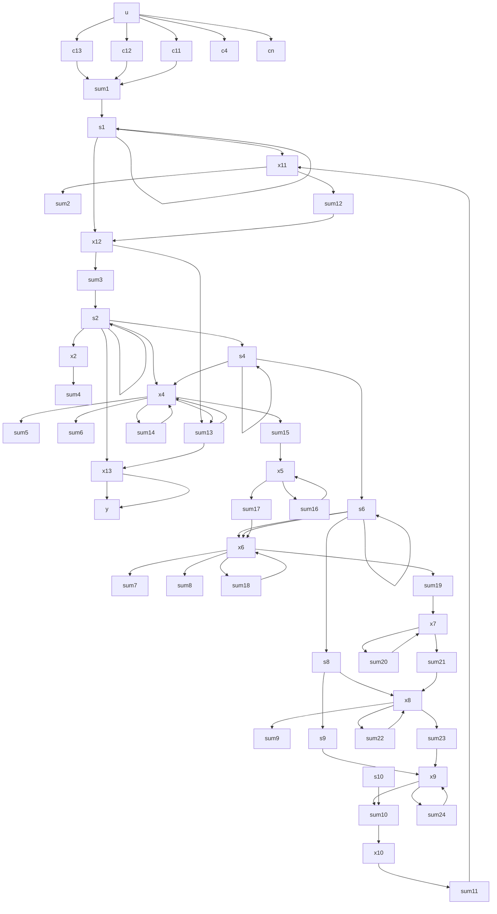

```mermaid
graph TD
    u --> c13
    u --> c12
    u --> c11
    u --> c4
    u --> cn
    c13 --> sum1
    c12 --> sum1
    c11 --> sum1
    sum1 --> s1
    s1 --> x11
    x11 --> sum2
    s1 --> s1
    s1 --> x12
    x12 --> sum3
    sum3 --> s2
    s2 --> x13
    x13 --> y
    s2 --> s2
    s2 --> x2
    x2 --> sum4
    s2 --> s4
    s2 --> x4
    x4 --> sum5
    s4 --> s4
    s4 --> x4
    x4 --> sum6
    s4 --> s6
    s6 --> x6
    x6 --> sum7
    s6 --> s6
    s6 --> x6
    x6 --> sum8
    s6 --> s8
    s8 --> x8
    x8 --> sum9
    s8 --> s9
    s9 --> x9
    x9 --> sum10
    s10 --> sum10
    sum10 --> x10
    x10 --> sum11
    sum11 --> x11
    x11 --> sum12
    sum12 --> x12
    x12 --> sum13
    sum13 --> x13
    x13 --> y
    x4 --> sum13
    sum13 --> x4
    x4 --> sum14
    sum14 --> x4
    x4 --> sum15
    sum15 --> x5
    x5 --> sum16
    sum16 --> x5
    x5 --> sum17
    sum17 --> x6
    x6 --> sum18
    sum18 --> x6
    x6 --> sum19
    sum19 --> x7
    x7 --> sum20
    sum20 --> x7
    x7 --> sum21
    sum21 --> x8
    x8 --> sum22
    sum22 --> x8
    x8 --> sum23
    sum23 --> x9
    x9 --> sum24
    sum24 --> x9
```

图 9-12 约当型动态方程的状态变量图
