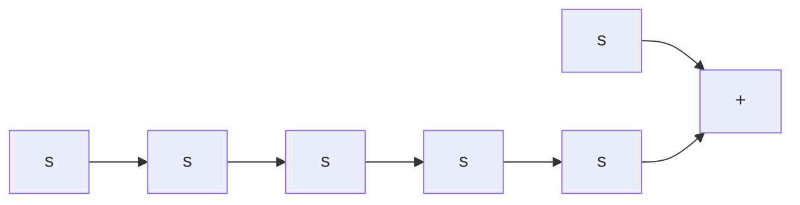

$$
(s \boldsymbol {I} - \boldsymbol {A}) ^ {- 1} = \left[ \begin{array}{c c} s & - 1 \\ 0 & s + 2 \end{array} \right] ^ {- 1} = \left[ \begin{array}{c c} \frac {1}{s} & \frac {1}{s (s + 2)} \\ 0 & \frac {1}{s + 2} \end{array} \right]

\boldsymbol {G} (s) = \boldsymbol {C} (s \boldsymbol {I} - \boldsymbol {A}) ^ {- 1} \boldsymbol {B} = \left[ \begin{array}{l l} 1 & 0 \\ 0 & 1 \end{array} \right] \left[ \begin{array}{c c} \frac {1}{s} & \frac {1}{s (s + 2)} \\ 0 & \frac {1}{s + 2} \end{array} \right] \left[ \begin{array}{l l} 1 & 0 \\ 0 & 1 \end{array} \right] = \left[ \begin{array}{c c} \frac {1}{s} & \frac {1}{s (s + 2)} \\ 0 & \frac {1}{s + 2} \end{array} \right]
$$

flowchart

