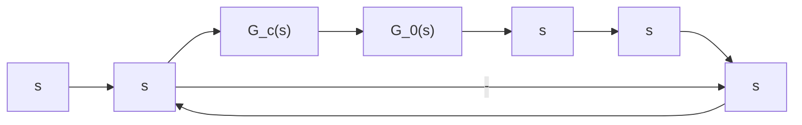

# (3) 解耦系统的传递矩阵

将式(9-49)写成标量方程组

$$
Y _ {1} (s) = G _ {1 1} (s) U _ {1} (s) + G _ {1 2} (s) U _ {2} (s) + \dots + G _ {1 p} (s) U _ {p} (s)
\begin{array}{l} Y _ {2} (s) = G _ {2 1} (s) U _ {1} (s) + G _ {2 2} (s) U _ {2} (s) + \dots + G _ {2 p} (s) U _ {p} (s) \\ \vdots \end{array} \tag {9-55}
Y _ {q} (s) = G _ {q 1} (s) U _ {1} (s) + G _ {q 2} (s) U _ {2} (s) + \dots + G _ {q p} (s) U _ {p} (s)
$$

可见，一般多输入-多输出系统的传递矩阵不是对角阵，每一个输入量将影响所有输出量，而每一个输出量也都会受到所有输入量的影响。这种系统称为耦合系统，其控制方式称为耦合控制。

对一个耦合系统进行控制是复杂的,工程中常希望实现某一输出量仅受某一输入量的控制,这种控制方式称为解耦控制,其相应的系统称为解耦系统。解耦系统的输入向量和输出向量必有相同的维数,传递矩阵必为对角阵,即

$$
\left[ \begin{array}{c} Y _ {1} (s) \\ Y _ {2} (s) \\ \vdots \\ Y _ {m} (s) \end{array} \right] = \left[ \begin{array}{c c c c} G _ {1 1} (s) & & & 0 \\ & G _ {2 2} (s) & & \\ 0 & & \ddots & \\ & & & G _ {m m} (s) \end{array} \right] \left[ \begin{array}{c} U _ {1} (s) \\ U _ {2} (s) \\ \vdots \\ U _ {m} (s) \end{array} \right] \tag {9-56}
$$

可以看出,解耦系统是由 m 个独立的单输入-单输出系统

$$Y _ {i} (s) = G _ {i i} (s) U _ {i} (s); \quad i = 1, 2, \dots , m \tag {9-57}$$

组成。为了控制每个输出量, $G_{ii}(s)$ 不得为零,即解耦系统的对角化传递矩阵必须是非奇异的。在系统中引入适当的校正环节使传递矩阵对角化,称为解耦。系统的解耦问题是一个相当复杂的问题,研究解耦问题的人很多,解耦的方法也很多。下面介绍适用于线性定常连续系统的两种简单解耦方法。

1) 用串联补偿器 $G_{c}(s)$ 实现解耦。系统结构图如图9-15所示。未引入 $G_{c}(s)$ 时，原系统为耦合系统，引入 $G_{c}(s)$ 后的闭环传递矩阵为

$$\boldsymbol {\Phi} (s) = \left[ \boldsymbol {I} + \boldsymbol {G} _ {0} (s) \boldsymbol {G} _ {c} (s) \boldsymbol {H} (s) \right] ^ {- 1} \boldsymbol {G} _ {0} (s) \boldsymbol {G} _ {c} (s) \tag {9-58}$$

以 $[I + G_0(s)G_c(s)H(s)]$ 左乘式(9-58)两端，经整理有

$$\mathbf {G} _ {0} (s) \mathbf {G} _ {c} (s) = \boldsymbol {\Phi} (s) [ \boldsymbol {I} - \boldsymbol {H} (s) \boldsymbol {\Phi} (s) ] ^ {- 1} \tag {9-59}$$

式中， $\Phi(s)$ 为所希望的对角阵，阵中各元素与性能指标要求有关。由式(9-59)可见，在 $H(s)$ 为

对角阵的条件下， $[I - H(s)\Phi (s)]^{-1}$ 仍为对角阵，故 $G_{0}(s)G_{c}(s)$ 应为对角阵，且有

$$\boldsymbol {G} _ {c} (s) = \boldsymbol {G} _ {0} ^ {- 1} (s) \boldsymbol {\Phi} (s) [ \boldsymbol {I} - \boldsymbol {H} (s) \boldsymbol {\Phi} (s) ] ^ {- 1} \tag {9-60}$$

按式(9-60)设计串联补偿器可使系统解耦。

flowchart

图 9-15 用串联补偿器实现解耦

