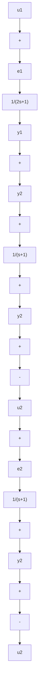

<details>
<summary>flowchart</summary>

```mermaid
graph LR
    U["s"] --> Gd["G_d(s)"]
    Gd --> U'[U'(s)]
    U' --> Sum((+))
    E["s"] --> G0["G_0(s)"]
    G0 --> Y["Y(s)"]
    Y --> Sum
    Sum -->|-| Sum
```
</details>

图 9-16 用前馈补偿器实现解耦

2) 用前馈补偿器 $G_{d}(s)$ 实现解耦。系统结构如图9-16所示， $G_{d}(s)$ 的作用是对输入进行适当变换以实现解耦。未引入 $G_{d}(s)$ 时原系统的闭环传递矩阵为

$$\boldsymbol {\Phi} ^ {\prime} (s) = \left[ \boldsymbol {I} + \boldsymbol {G} _ {0} (s) \right] ^ {- 1} \boldsymbol {G} _ {0} (s) \tag {9-61}$$

引入 $G_{d}(s)$ 后解耦系统的闭环传递矩阵为

$$\boldsymbol {\Phi} (s) = \boldsymbol {\Phi} ^ {\prime} (s) \mathbf {G} _ {d} (s) = [ \mathbf {I} + \mathbf {G} _ {0} (s) ] ^ {- 1} \mathbf {G} _ {0} (s) \mathbf {G} _ {d} (s) \tag {9-62}$$

式中， $\Phi(s)$ 为所希望的对角阵。由式(9-62)可得

$$\mathbf {G} _ {d} (s) = \mathbf {G} _ {0} ^ {- 1} (s) [ \mathbf {I} + \mathbf {G} _ {0} (s) ] \boldsymbol {\Phi} (s) \tag {9-63}$$

按式(9-63)设计前馈补偿器可使系统解耦。

例 9-7 已知双输入-双输出单位反馈系统结构图如图 9-17 所示。试列写原系统的开、闭环传递矩阵，并求串联补偿器和前馈补偿器，使解耦系统的闭环传递矩阵为

$$
\boldsymbol {\Phi} (s) = \left[ \begin{array}{c c} \frac {1}{s + 1} & 0 \\ 0 & \frac {1}{5 s + 1} \end{array} \right]
$$

并画出解耦系统的结构图。

解 求原系统开环传递矩阵 $G_{0}(s)$ ，只需写出输出量 $(y_{1}, y_{2})$ 与误差量 $(e_{1}, e_{2})$ 各分量之间的关系，即


<details>
<summary>flowchart</summary>


</details>

图 9-17 系统结构图

$$Y _ {1} (s) = \frac {1}{2 s + 1} E _ {1} (s)Y _ {2} (s) = E _ {1} (s) + \frac {1}{s + 1} E _ {2} (s)$$

其向量-矩阵形式为

$$
\begin{array}{l} \mathbf {Y} (s) = \left[ \begin{array}{c} \mathbf {Y} _ {1} (s) \\ \mathbf {Y} _ {2} (s) \end{array} \right] = \left[ \begin{array}{c c} \frac {1}{2 s + 1} & 0 \\ 1 & \frac {1}{s + 1} \end{array} \right] \left[ \begin{array}{c} E _ {1} (s) \\ E _ {2} (s) \end{array} \right] \\ = \mathbf {G} _ {0} (s) \mathbf {E} (s) \\ \end{array}
$$

原系统开环传递矩阵为

$$
\mathbf {G} _ {0} (s) = \left[ \begin{array}{c c} \frac {1}{2 s + 1} & 0 \\ 1 & \frac {1}{s + 1} \end{array} \right]
$$

输出量 $(y_{1},y_{2})$ 与输入量 $(u_{1},u_{2})$ 各分量之间的关系为
