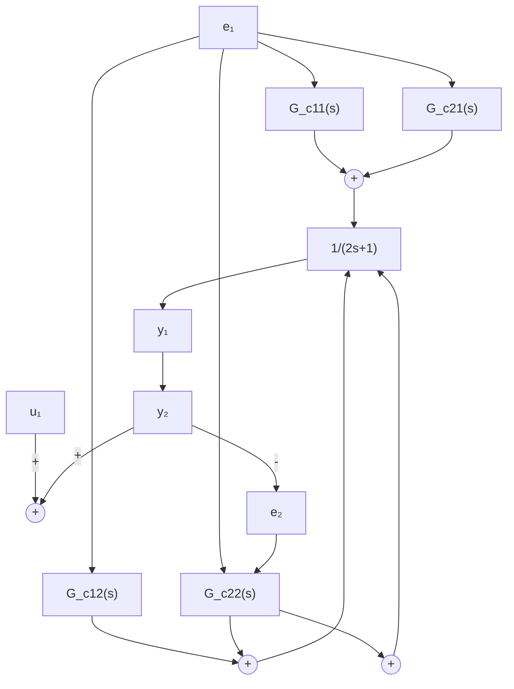
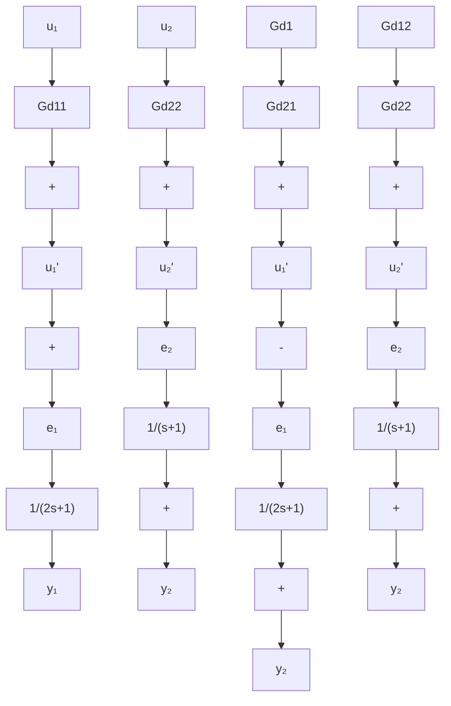

$$
\mathbf {G} _ {d} (s) = \boldsymbol {\Phi} ^ {\prime - 1} (s) \boldsymbol {\Phi} (s) = \left[ \begin{array}{c c} \frac {1}{2 (s + 1)} & 0 \\ \frac {2 s + 1}{2 (s + 2)} & \frac {1}{s + 2} \end{array} \right] ^ {- 1} \left[ \begin{array}{c c} \frac {1}{s + 1} & 0 \\ 0 & \frac {1}{5 s + 1} \end{array} \right]

= \left[ \begin{array}{c c} 2 (s + 1) & 0 \\ - (2 s + 1) (s + 1) & s + 2 \end{array} \right] \left[ \begin{array}{c c} \frac {1}{s + 1} & 0 \\ 0 & \frac {1}{5 s + 1} \end{array} \right]

= \left[ \begin{array}{c c} 2 & 0 \\ - (2 s + 1) & \frac {s + 2}{5 s + 1} \end{array} \right] = \left[ \begin{array}{l l} G _ {d 1 1} (s) & G _ {d 1 2} (s) \\ G _ {d 2 1} (s) & G _ {d 2 2} (s) \end{array} \right]
$$

式中， $G_{dij}(s)$ 表示 $U_{j}(s)$ 至 $U_{i}^{\prime}(s)(i,j=1,2)$ 通道的串联补偿器传递函数。

用前馈补偿器实现解耦的系统结构图见图 9-19。

flowchart

图 9-18 用串联补偿器实现解耦的系统结构图

flowchart

图 9-19 用前馈补偿器实现解耦的系统结构图
