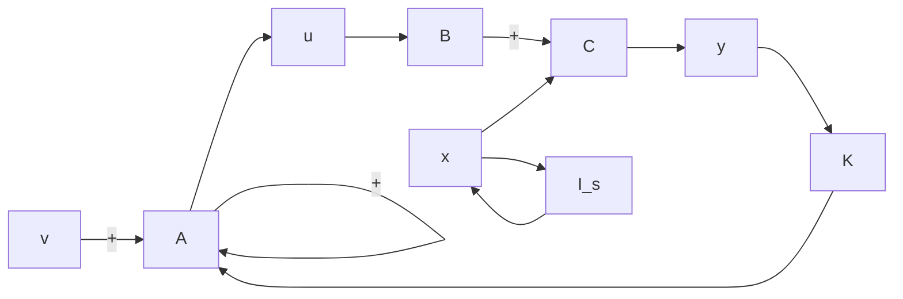
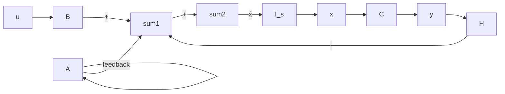

# (1) 两种常用反馈结构

在系统的综合设计中,两种常用的反馈形式是线性直接状态反馈和线性非动态输出反馈,简称为状态反馈和输出反馈。

1）状态反馈。设有 n 维线性定常系统

$$\dot {\boldsymbol {x}} = \boldsymbol {A} \boldsymbol {x} + \boldsymbol {B} \boldsymbol {u}, \quad \boldsymbol {y} = \boldsymbol {C} \boldsymbol {x} \tag {9-208}$$

式中， $x, u, y$ 分别为 $n$ 维、 $p$ 维和 $q$ 维向量； $\mathbf{A}, \mathbf{B}, \mathbf{C}$ 分别为 $n \times n, n \times p, q \times n$ 实数矩阵。

当将系统的控制量 u 取为状态变量的线性函数

$$\boldsymbol {u} = \boldsymbol {v} - \boldsymbol {K x} \tag {9-209}$$

时，称之为线性直接状态反馈，简称为状态反馈，其中 $\pmb{v}$ 为 $p$ 维参考输入向量， $\pmb{K}$ 为 $(p \times n)$ 维实反馈增益矩阵。在研究状态反馈时，假定所有的状态变量都是可以用来反馈的。

将式(9-209)代入式(9-208)可得状态反馈系统动态方程

$$\dot {\boldsymbol {x}} = (\boldsymbol {A} - \boldsymbol {B K}) \boldsymbol {x} + \boldsymbol {B v}, \quad \boldsymbol {y} = \boldsymbol {C x} \tag {9-210}$$

其传递函数矩阵为

$$\mathbf {G} _ {K} (s) = \mathbf {C} (s \mathbf {I} - \mathbf {A} + \mathbf {B K}) ^ {- 1} \mathbf {B} \tag {9-211}$$

因此可用 $\{A-BK,B,C\}$ 来表示引入状态反馈后的闭环系统。由式(9-210)可以看出，引入状态反馈后系统的输出方程没有变化。

加入状态反馈后系统结构图如图 9-23 所示。

flowchart

图 9-23 加入状态反馈后系统结构图

2) 输出反馈。系统的状态常常不能全部测量到，因而状态反馈法的应用受到了限制。在此情况下，人们常常采用输出反馈法。输出反馈的目的首先是使系统闭环成为稳定系统，然后在此基础上进一步改善闭环系统性能。

输出反馈有两种形式:一种是将输出量反馈至状态微分,另一种是将输出量反馈至参考输入。

输出量反馈至状态微分系统结构图如图 9-24 所示。输出反馈系统的动态方程为

flowchart

图 9-24 输出反馈至状态微分系统结构图

$$\dot {x} = A x + B u - H y = (A - H C) x + B u, \quad y = C x \tag {9-212}$$

其传递函数矩阵为

$$\boldsymbol {G} _ {H} (s) = \boldsymbol {C} (s \boldsymbol {I} - \boldsymbol {A} + \boldsymbol {H C}) ^ {- 1} \boldsymbol {B} \tag {9-213}$$

将输出量反馈至参考输入系统结构图如图9-25所示。当将系统的控制量 $\pmb{u}$ 取为输出 $\pmb{y}$ 的线性函数

$$\boldsymbol {u} = \boldsymbol {v} - \boldsymbol {F y} \tag {9-214}$$

时，称之为线性非动态输出反馈，常简称为输出反馈，其中 $\pmb{v}$ 为 $p$ 维参考输入向量， $\pmb{F}$ 为 $p \times q$ 维实反馈增益矩阵。这是一种最常用的输出反馈，在一些参考书中往往只介绍这一种输出反馈，而不介绍输出至状态微分的反馈。

将式(9-214)代入式(9-208)可得输出反馈系统动态方程
