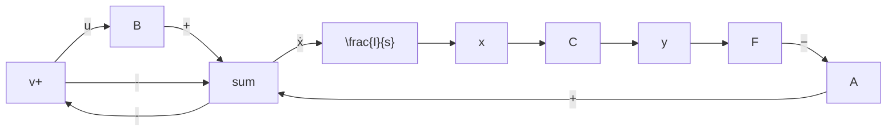

$$\dot {\boldsymbol {x}} = (\boldsymbol {A} - \boldsymbol {B F C}) \boldsymbol {x} + \boldsymbol {B v}, \quad \boldsymbol {y} = \boldsymbol {C x} \tag {9-215}$$

其传递函数矩阵为

$$\mathbf {G} _ {F} (s) = \mathbf {C} (s \mathbf {I} - \mathbf {A} + \mathbf {B F C}) ^ {- 1} \mathbf {B} \tag {9-216}$$

flowchart

图 9-25 输出反馈至参考输入系统结构图

不难看出,不管是状态反馈还是输出反馈,都可以改变状态的系数矩阵,但这并不表明二者具有等同的功能。由于状态能完整地表征系统的动态行为,因而利用状态反馈时,其信息量大而完整,可以在不增加系统维数的情况下,自由地支配响应特性。而输出反馈仅利用了状态变量的线性组合进行反馈,其信息量较小,所引入的补偿装置将使系统维数增加,且难以得到任意的所期望的响应特性。一个输出反馈系统的性能,一定有对应的状态反馈系统与之等同,例如对于图9-25所示输出反馈系统,只要令FC=K便可确定状态反馈增益矩阵。但是,对于一个状态反馈系统,却不一定有对应的输出反馈系统与之等同,这是由于令K=FC来求解矩阵F时,有可能因F含有高阶导数而无法实现。对于非最小相位被控对象,如果含有在复平面右半平面上的极点,并且选择在复平面右半平面上的校正零点来加以对消时,便会有不稳定的隐患。但是,由于输出反馈所用的输出变量总是容易测量的,实现起来比较方便,因而获得了较广泛的应用。对于状态反馈系统中不便测量或不能测量的状态变量,需要利用状态观测器进行重构。有关状态观测器的设计问题,后面将作进一步阐述。
