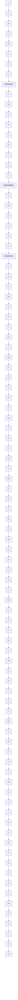

```mermaid
graph TD
    v --> A["○"]
    A --> B["B"]
    B --> C["×"]
    C --> D["I/s"]
    D --> E["x"]
    E --> F["C"]
    F --> y
    y --> G["状态反馈部分"]
    G --> H["×"]
    H --> I["I/s"]
    I --> J["x̂"]
    J --> K["A"]
    K --> L["×"]
    L --> M["A"]
    M --> N["×"]
    N --> O["H"]
    O --> P["×"]
    P --> Q["状态观测器部分"]
    Q --> R["×"]
    R --> S["I/s"]
    S --> T["x̂"]
    T --> U["C"]
    U --> V["ŷ"]
    V --> W["×"]
    W --> X["状态反馈部分"]
    X --> Y["×"]
    Y --> Z["H"]
    Z --> AA["×"]
    AA --> AB["I/s"]
    AB --> AC["x̂"]
    AC --> AD["A"]
    AD --> AE["×"]
    AE --> AF["H"]
    AF --> AG["×"]
    AG --> AH["I/s"]
    AH --> AI["x̂"]
    AI --> AJ["A"]
    AJ --> AK["×"]
    AK --> AL["H"]
    AL --> AM["×"]
    AM --> AN["I/s"]
    AN --> AO["x̂"]
    AO --> AP["A"]
    AP --> AQ["×"]
    AQ --> AR["H"]
    AR --> AS["×"]
    AS --> AT["I/s"]
    AT --> AU["x̂"]
    AU --> AV["A"]
    AV --> AW["×"]
    AW --> AX["H"]
    AX --> AY["×"]
    AY --> AZ["I/s"]
    AZ --> BA["x̂"]
    BA --> BB["A"]
    BB --> BC["×"]
    BC --> BD["H"]
    BD --> BE["×"]
    BE --> BF["I/s"]
    BF --> BG["x̂"]
    BG --> BH["A"]
    BH --> BI["×"]
    BI --> BJ["H"]
    BJ --> BK["×"]
    BK --> BL["I/s"]
    BL --> BM["x̂"]
    BM --> BN["A"]
    BN --> BO["×"]
    BO --> BP["H"]
    BP --> BQ["×"]
    BQ --> BR["I/s"]
    BR --> BS["x̂"]
    BS --> BT["A"]
    BT --> BU["×"]
    BU --> BV["H"]
    BV --> BW["×"]
    BW --> BX["I/s"]
    BX --> BY["x̂"]
    BY --> BZ["A"]
    BZ --> CA["×"]
    CA --> CB["H"]
    CB --> CC["×"]
    CC --> CD["I/s"]
    CD --> CE["x̂"]
    CE --> CF["A"]
    CF --> CG["×"]
    CG --> CH["H"]
    CH --> CI["×"]
    CI --> CJ["I/s"]
    CJ --> CK["x̂"]
    CK --> CL["A"]
    CL --> CM["×"]
    CM --> CN["H"]
    CN --> CO["H"]
```

图 9-26 状态观测器及其实现状态反馈结构图
