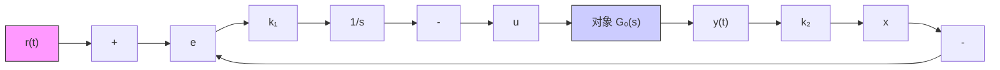

图 9-29 阶跃输入的内模设计

下例为一个具体系统的单位阶跃输入内模控制器的设计过程。设有

$$
\dot {\boldsymbol {x}} (t) = \left[ \begin{array}{c c} 0 & 1 \\ - 2 & - 2 \end{array} \right] \boldsymbol {x} (t) + \left[ \begin{array}{c} 1 \\ 2 \end{array} \right] \boldsymbol {u} (t)
y (t) = [ 1 \quad 0 ] x (t)
$$

要求系统输出能以零稳态误差跟踪单位阶跃参考输入信号。由式(9-273)知，增广系统方程为

$$
\left[ \begin{array}{c} \dot {e} \\ \dot {\boldsymbol {z}} \end{array} \right] = \left[ \begin{array}{c c c} 0 & - 1 & 0 \\ 0 & 0 & 1 \\ 0 & - 2 & - 2 \end{array} \right] \left[ \begin{array}{c} e \\ \boldsymbol {z} \end{array} \right] + \left[ \begin{array}{c} 0 \\ 1 \\ 2 \end{array} \right] w
$$

由于可控性矩阵

$$
\operatorname{rank} \left[ \begin{array}{c c c} 0 & - \boldsymbol {c b} & - \boldsymbol {c A b} \\ \boldsymbol {b} & \boldsymbol {A b} & \boldsymbol {A ^ {2}} \boldsymbol {b} \end{array} \right] = \operatorname{rank} \left[ \begin{array}{c c c} 0 & - 1 & - 2 \\ 1 & 2 & - 6 \\ 2 & - 6 & 8 \end{array} \right] = 3
$$

满秩，增广系统可控，故通过状态反馈

$$
w = - k \left[ \begin{array}{l} e \\ z \end{array} \right] = - k _ {1} e - k _ {2} z _ {1} - k _ {3} z _ {2}
$$

式中 $k=\left[k_{1}\quad k_{2}\quad k_{3}\right]$ ，可任意配置闭环增广系统

$$
\left[ \begin{array}{l} \dot {e} \\ \dot {z} _ {1} \\ \dot {z} _ {2} \end{array} \right] = \left\{\left[ \begin{array}{c c c} 0 & - 1 & 0 \\ 0 & 0 & 1 \\ 0 & - 2 & - 2 \end{array} \right] - \left[ \begin{array}{l} 0 \\ 1 \\ 2 \end{array} \right] \left[ \begin{array}{l l l} k _ {1} & k _ {2} & k _ {3} \end{array} \right] \right\} \left[ \begin{array}{l} e \\ z _ {1} \\ z _ {2} \end{array} \right]
$$

的极点。如果要求闭环极点为 $s_{1,2} = -1 \pm j, s_3 = -10$ ，则希望特征方程为

$$(s + 1 + \mathrm{j}) (s + 1 - \mathrm{j}) (s + 1 0) = s ^ {3} + 1 2 s ^ {2} + 2 2 s + 2 0 = 0$$

而实际特征方程为

$$
\begin{array}{l} \det \left[ \begin{array}{c c c} s & 1 & 0 \\ k _ {1} & s + k _ {2} & k _ {3} - 1 \\ 2 k _ {1} & 2 (1 + k _ {2}) & s + 2 + 2 k _ {3} \end{array} \right] \\ = s ^ {3} + \left(k _ {2} + 2 k _ {3} + 2\right) s ^ {2} + \left(2 - k _ {1} + 4 k _ {2} - 2 k _ {3}\right) s - 4 k _ {1} = 0 \\ \end{array}
$$

令上述两个特征方程式的对应项系数相等,解得

$$k _ {1} = - 5, k _ {2} = 5, k _ {3} = 2. 5$$

则由式(9-276)得内模控制律为

$$u (t) = 5 \int_ {0} ^ {t} e (\tau) \mathrm{d} \tau - 5 x _ {1} (t) - 2. 5 x _ {2} (t)$$

相应的单位阶跃输入内模控制系统的结构图如图 9-30 所示。
