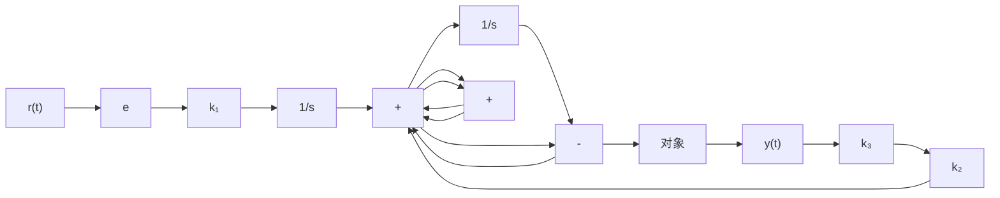

$$
\operatorname{rank} \left[ \begin{array}{c c c c} 0 & 0 & - c b & - c A b \\ 0 & - c b & - c A b & - c A ^ {2} b \\ b & A b & A ^ {2} b & A ^ {3} b \end{array} \right] = n + 2
$$

则存在状态反馈

$$
w = - \left[ \begin{array}{l l l} k _ {1} & k _ {2} & k _ {3} \end{array} \right] \left[ \begin{array}{l} e \\ \dot {e} \\ z \end{array} \right] = - k _ {1} e - k _ {2} \dot {e} - k _ {3} z \tag {9-278}
$$

使增广闭环系统

$$
\begin{array}{l} \left[ \begin{array}{l} \dot {e} \\ \ddot {e} \\ \dot {z} \end{array} \right] = \left\{\left[ \begin{array}{c c c} 0 & 1 & 0 \\ 0 & 0 & - c \\ 0 & 0 & A \end{array} \right] - \left[ \begin{array}{l} 0 \\ 0 \\ b \end{array} \right] \left[ \begin{array}{l l l} k _ {1} & k _ {2} & k _ {3} \end{array} \right] \right\} \left[ \begin{array}{l} e \\ \dot {e} \\ z \end{array} \right] \\ = \left[ \begin{array}{c c c} 0 & 1 & 0 \\ 0 & 0 & - \boldsymbol {c c c} \\ - k _ {1} \boldsymbol {b} & - k _ {2} \boldsymbol {b} & \boldsymbol {A} - \boldsymbol {b k} _ {3} \end{array} \right] \left[ \begin{array}{l} e \\ \dot {e} \\ z \end{array} \right] \tag {9-279} \\ \end{array}
$$

渐近稳定。其中， $k_{1}, k_{2}$ 和 $k_{3}$ 可由要求的闭环增广系统(9-278)的极点位置来确定。这样，当 $t \to \infty$ 时，必有 $e(t) \to 0$ 。

对式(9-278)作二次积分,可得含有输入内模信息的反馈控制信号

$$u (t) = - k _ {1} \int_ {0} ^ {t} \int_ {0} ^ {t} e (\tau) \mathrm{d} \tau \mathrm{d} \tau - k _ {2} \int_ {0} ^ {t} e (\tau) \mathrm{d} \tau - k _ {3} x (t)$$

斜坡输入的内模设计系统框图如图 9-32 所示。

flowchart

图 9-32 斜坡输入的内模设计

由图 9-32 可见, 虚框表示的控制器中含有两个积分器, 这正是斜坡输入的内模形式。类似地, 可以将内模方法推广到处理其他参考输入形式。此外, 如果将扰动信号的生成模型也纳入校正控制器中, 还可以通过扰动内模设计来克服持续扰动对系统性能的影响, 请参见本章习题。
