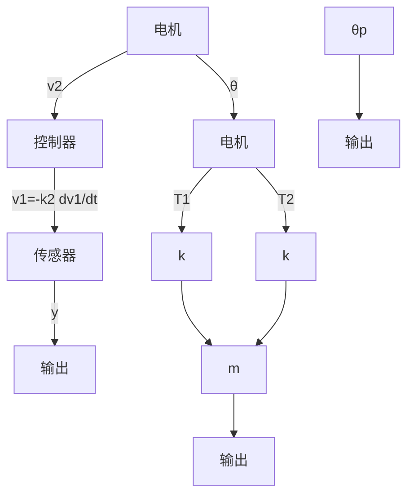

# 例 9-27 打印机皮带驱动器

在计算机外围设备中,常用的低价位打印机都配有皮带驱动器,用于驱动打印头沿打印页面横向移动。打印头可能是喷墨式或针式的。图 9-33 是一个装有直流电机的皮带驱动式打印机,其光传感器用来测定打印头的位置,皮带张力变化用于调节皮带的实际弹性状态。

设计要求：

1）建立系统的状态空间模型，选择合适的电机参数、滑轮参数和控制器参数；

2）研究皮带弹性系数 k 对打印机抗外界扰动性能的影响。

解 1) 状态空间建模及系统参数选择。图 9-34 为打印机皮带驱动器的基本模型。模型中记皮带弹性系数为 k，滑轮半径为 r，电机轴转角为 $\theta$ ，右滑轮的转角为 $\theta_{p}$ ，打印头质量为 m，打印头位移为 $y(t)$ 。光传感器用来测量 $y(t)$ ，光传感器的输出电压为 $v_{1}$ ，且 $v_{1}=k_{1}y$ 。控制器输出电压为 $v_{2}$ ，对系统进行速度反馈，即有 $v_{2}=-k_{2}\frac{dv_{1}}{dt}$ 。

flowchart

图 9-32 打印机皮带驱动系统  

flowchart

图 9-34 打印机皮带驱动模型

系统参数取值情况如表 9-2 所示。

表 9-2 打印装置的参数

<table><tr><td>质量</td><td>m=0.2kg</td></tr><tr><td>光传感器</td><td>k1=1V/m</td></tr><tr><td>滑轮半径</td><td>r=0.015m</td></tr><tr><td colspan="2">电机</td></tr><tr><td>电感</td><td>L≈0</td></tr><tr><td>电机和滑轮的摩擦系数</td><td>f=0.25N·m·s</td></tr><tr><td>电枢电阻</td><td>R=2Ω</td></tr><tr><td>电机传递系数</td><td>Km=2kg·m/A</td></tr><tr><td>电机和滑轮的转动惯量</td><td>J电机 + J滑轮 = J = 0.01kg·m²</td></tr></table>

下面推导系统的运动方程。注意到 $y=r\theta_{p}$ ，可知皮带张力 $T_{1}$ 和 $T_{2}$ 分别为

$$T _ {1} = k (r \theta - r \theta_ {p}) = k (r \theta - y), \quad T _ {2} = k (y - r \theta)$$

式中， $k$ 为皮带弹性系数。于是，作用在质量 $m$ 上的皮带净张力为

$$T _ {1} - T _ {2} = 2 k (r \theta - y) = 2 k x _ {1}$$

其中， $x_{1}=r\theta-y$ 为第一个状态变量，表示打印头实际位移 y 与预期位移 $r\theta$ 之间的位移差。显然，质量 m 的运动方程为

$$m \frac {\mathrm{d} ^ {2} y}{\mathrm{d} t ^ {2}} = T _ {1} - T _ {2} = 2 k x _ {1}$$

取第二个状态变量为 $x_{2} = \frac{\mathrm{dy}}{\mathrm{dt}}$ ，于是有

$$\frac {\mathrm{d} x _ {2}}{\mathrm{d} t} = \frac {2 k}{m} x _ {1} \tag {9-280}$$

定义第三个状态变量为 $x_{3} = \frac{\mathrm{d}\theta}{\mathrm{d}t}$ ，则 $x_{1}$ 的导数

$$\frac {\mathrm{d} x _ {1}}{\mathrm{d} t} = r \frac {\mathrm{d} \theta}{\mathrm{d} t} - \frac {\mathrm{d} y}{\mathrm{d} t} = - x _ {2} + r x _ {3} \tag {9-281}$$
