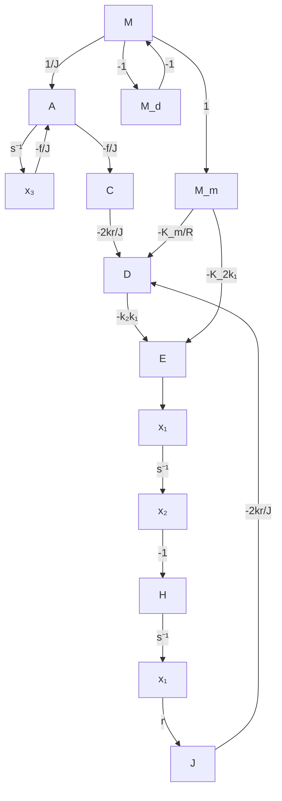

接着，推导电机旋转的运动方程：当 $L = 0$ 时，电机电枢电流 $i = \frac{v_2}{R}$ ，而电机转矩为 $M_{m} = K_{m}i$ ，于是有

$$M _ {m} = \frac {K _ {m}}{R} v _ {2} \tag {9-282}$$

设作用在驱动皮带上的扰动转矩为 $M_{d}$ ，则电机驱动皮带的有效转矩为 $M = M_{m} - M_{d}$ 。显然，只有有效转矩驱动电机轴带动滑轮运动，因此有

$$M = J \frac {\mathrm{d} ^ {2} \theta}{\mathrm{d} t ^ {2}} + f \frac {\mathrm{d} \theta}{\mathrm{d} t} + r (T _ {1} - T _ {2})$$

由于 $\frac{\mathrm{d}x_3}{\mathrm{d}t} = \frac{\mathrm{d}^2\theta}{\mathrm{d}t^2}, T_1 - T_2 = 2kx_1$

故得 $\frac{\mathrm{d}x_3}{\mathrm{d}t} = \frac{M_m - M_d}{J} -\frac{f}{J} x_3 - \frac{2kr}{J} x_1$

在上式中，代入式(9-282)以及

$$v _ {2} = - k _ {2} \frac {\mathrm{d} v _ {1}}{\mathrm{d} t}v _ {1} = k _ {1} y, x _ {2} = \frac {\mathrm{d} y}{\mathrm{d} t}$$

得到 $\frac{M_m}{J} = \frac{K_m}{RJ} v_2 = -\frac{K_m k_2}{RJ} \frac{\mathrm{d}v_1}{\mathrm{d}t} = -\frac{K_m k_1 k_2}{RJ} x_2$

最后可得

$$\frac {\mathrm{d} x _ {3}}{\mathrm{d} t} = - \frac {2 k r}{J} x _ {1} - \frac {K _ {m} k _ {1} k _ {2}}{R J} x _ {2} - \frac {f}{J} x _ {3} - \frac {M _ {d}}{J} \tag {9-283}$$

式(9-281)～式(9-283)构成了描述打印机皮带驱动系统的一阶运动微分方程组,其向量-矩阵形式为

$$
\dot {\boldsymbol {x}} = \left[ \begin{array}{c c c} 0 & - 1 & r \\ \frac {2 k}{m} & 0 & 0 \\ - \frac {2 k r}{J} & - \frac {K _ {m} k _ {1} k _ {2}}{R J} & - \frac {f}{J} \end{array} \right] \boldsymbol {x} + \left[ \begin{array}{c} 0 \\ 0 \\ - \frac {1}{J} \end{array} \right] M _ {d} \tag {9-284}
$$

式(9-284)的信号流图如图9-35所示，图中还表示了扰动力矩 $M_{d}$ 的节点。

flowchart

图 9-35 打印机皮带驱动系统的信号流图模型

2) 皮带弹性系数的影响。为了研究如何抑制 $M_{d}$ 对系统性能的影响，可由图9-35确定传递函数 $X_{1}(s) / M_{d}(s)$ 。利用梅森增益公式，可得

$$\frac {X _ {1} (s)}{M _ {d} (s)} = \frac {- \frac {r}{J} s ^ {- 2}}{1 - \left(L _ {1} + L _ {2} + L _ {3} + L _ {4}\right) + L _ {1} L _ {2}}$$

其中回路增益

$$L _ {1} = - \frac {f}{J} s ^ {- 1}, L _ {2} = - \frac {2 k}{m} s ^ {- 2}L _ {3} = - \frac {2 k r ^ {2}}{J} s ^ {- 2}, L _ {4} = - \frac {2 k k _ {1} k _ {2} K _ {m} r}{m R J} s ^ {- 3}$$
