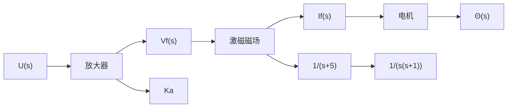

# 例 9-28 自动检测系统

电气开关面板上有各种开关、继电器和指示灯，若采用手工方式检测，会降低产量并造成较大的检验误差。图9-37是一个自动检测系统示意图，该系统通过直流电机来驱动一组探针，使探针穿过零件的引线，以便检测零件的导通性能、电阻及其他功能参数。


<details>
<summary>text_image</summary>

导轨
导杆
探针
开关面板
电机
磁场电压
编码器
解码器
</details>

图 9-37 自动检测系统

该自动检测系统利用直流电机上的编码器来测量电压和探针的位置,如图 9-38 所示。其结构图模型如图 9-39 所示,其中 $K_{a}$ 为所需要的功率放大系数。

设状态变量选择为: $x_{1}=\theta,x_{2}=d\theta/dt,x_{3}=i_{f}$ ; 假定这些状态变量均可测, 且能用于反馈。图9-40所示为其闭环系统, 其中控制律

$$u = - K _ {1} x _ {1} - K _ {2} x _ {2} - K _ {3} x _ {3}$$

本例的设计目标是：合理选择放大器增益 $K_{a}$ 和状态反馈增益 $K_{1}, K_{2}$ 和 $K_{3}$ ，使系统单位阶跃响应的调节时间小于 $2s(\Delta = 2\%)$ ，超调量小于 $4\%$ 。

解 首先列写系统的状态方程。由图 9-40 可见, 当系统状态反馈未接入时, 有

$$
\dot {\boldsymbol {x}} (t) = \boldsymbol {A} \boldsymbol {x} (t) + \boldsymbol {b} \boldsymbol {u} (t)
= \left[ \begin{array}{c c c} 0 & 1 & 0 \\ 0 & - 1 & 1 \\ 0 & 0 & - 5 \end{array} \right] \boldsymbol {x} + \left[ \begin{array}{c} 0 \\ 0 \\ K _ {a} \end{array} \right] \boldsymbol {u}
$$


<details>
<summary>text_image</summary>

直流电机
θ
i_f
磁场电流
增量编码器
解码器
θ
dθ/dt
</details>

图 9-38 装有编码轮盘的直流电机


<details>
<summary>flowchart</summary>


</details>

图 9-39 结构图模型


<details>
<summary>flowchart</summary>

```mermaid
graph LR
    A["R(s) 输入"] -->|1| B["U(s)"]
    B -->|K_a| C["1/(s+5)"]
    C --> D["x_3"]
    D -->|1/(s+1)| E["x_2"]
    E -->|1/s| F["x_1"]
    F --> G["输出位置"]
    B -->|-K_3| H["-K_2"]
    H -->|-K_1| F
```
</details>

图 9-40 自动检测反馈控制系统

当系统接入状态反馈控制律，并令 $K_{1}=1$ 时，得闭环系统方程为

$$
\dot {\boldsymbol {x}} (t) = \left[ \begin{array}{c c c} 0 & 1 & 0 \\ 0 & - 1 & 1 \\ - K _ {a} & - K _ {a} K _ {2} & - (5 + K _ {a} K _ {3}) \end{array} \right] \boldsymbol {x} (t) = \overline {{{\boldsymbol {A}}}} \boldsymbol {x} (t)
$$

令 $\det(sI-\bar{A})=0$ , 得闭环系统特征方程

$$s ^ {3} + (6 + K _ {a} K _ {3}) s ^ {2} + [ 5 + K _ {a} (K _ {2} + K _ {3}) ] s + K _ {a} = 0$$

上式可写为

$$s (s + 1) (s + 5) + K _ {a} K _ {3} \left(s ^ {2} + \frac {K _ {2} + K _ {3}}{K _ {3}} s + \frac {1}{K _ {3}}\right) = 0$$

其等效闭环特征方程为
