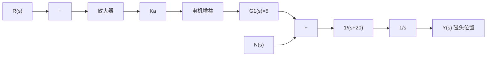
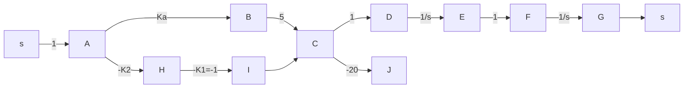

# 例 9-29 磁盘驱动读取系统(续)

现代磁盘在每厘米宽度内有 5000 个磁道，每个磁道的典型宽度仅为 $1 \mu m$ ，因此磁盘驱动读取系统对磁头的定位精度和磁头在磁道间移动的动态过程有严格的要求。

line

| Time /sec | Amplitude |
| --- | --- |
| 0.0 | 0.0 |
| 0.5 | 0.6 |
| 1.0 | 1.0 |
| 1.5 | 1.0 |
| 2.0 | 1.0 |
| 2.5 | 1.0 |
| 3.0 | 1.0 |

图 9-42 自动测试系统的阶跃响应(MATLAB)

flowchart

图 9-43 磁头控制系统的开环模型

当不考虑磁场电感影响时,磁头控制系统的二阶开环模型如图 9-43 所示,采用状态反馈控制器后的闭环系统如图 9-44 所示。设计要求:

flowchart

图 9-44 具有两条状态变量反馈回路的闭环系统

1) 选择放大器增益 $K_{a}$ 和反馈系数 $K_{2}$ , 使系统二阶模型响应满足表 9-3 所示性能指

标要求；

2）若考虑磁场电感的影响，且设电感 L 为 1mH，则磁盘驱动读取系统中的电机传递函数为

$$G _ {1} (s) = \frac {5 0 0 0}{s + 1 0 0 0}$$

要求采用系统的三阶模型检验系统采用二阶模型时的设计结果。

表 9-3 磁盘驱动控制系统的设计要求和实际性能

<table><tr><td>性能指标</td><td>期望值</td><td>二阶模型响应</td><td>三阶模型响应</td></tr><tr><td>超调量</td><td>&lt;5%</td><td>&lt;2%</td><td>0%</td></tr><tr><td>调节时间/ms</td><td>&lt;50</td><td>40.2</td><td>40.3</td></tr><tr><td>单位阶跃扰动的响应峰值</td><td>5.2×10-3</td><td>5.2×10-5</td><td>5.2×10-5</td></tr></table>

解 首先建立系统的状态空间模型。选择状态变量为: $x_{1}(t) = y(t), x_{2}(t) = \mathrm{d}y(t) / \mathrm{d}t = \mathrm{d}x_{1}(t) / \mathrm{d}t$ ，由图9-43知，开环系统的二阶模型的状态方程为

$$
\dot {\boldsymbol {x}} (t) = \left[ \begin{array}{c c} 0 & 1 \\ 0 & - 2 0 \end{array} \right] \boldsymbol {x} (t) + \left[ \begin{array}{c} 0 \\ 5 K _ {a} \end{array} \right] r (t)
$$

假定磁头的位置及速度均可以测量,根据图 9-44 所示的状态反馈闭环系统,可得闭环系统的状态方程为

$$
\dot {\boldsymbol {x}} (t) = \left[ \begin{array}{c c} 0 & 1 \\ - 5 K _ {1} K _ {a} & - (2 0 + 5 K _ {2} K _ {a}) \end{array} \right] \boldsymbol {x} (t) + \left[ \begin{array}{l} 0 \\ 5 K _ {a} \end{array} \right] r (t)
$$

在上式中代入 $K_{1} = 1$ ，可由 $\operatorname{det}(sI - \overline{A}) = 0$ （其中 $\overline{A}$ 为闭环系统阵），得
