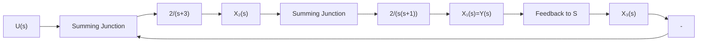

# 9-3 设系统微分方程为

$$\ddot {y} + 6 \dot {y} + 1 1 \dot {y} + 6 y = 6 u$$

式中，u, y 分别为系统的输入、输出量。试列写可控标准型（即 A 为友矩阵）及可观测标准型（即 A 为友矩阵转置）状态空间表达式，并画出状态变量图。

9-4 已知系统结构图如图 9-46 所示, 其状态变量为 $x_{1}, x_{2}, x_{3}$ 。试求动态方程, 并画出状态变量图。

flowchart

图 9-46 习题 9-4 系统结构图

9-5 已知双输入-双输出系统状态方程和输出方程

$$
\begin{array}{l} \dot {x} _ {1} = x _ {2} + u _ {1} \\ \dot {x} _ {2} = x _ {3} + 2 u _ {1} - u _ {2} \\ \dot {x} _ {3} = - 6 x _ {1} - 1 1 x _ {2} - 6 x _ {3} + 2 u _ {2} \\ y _ {1} = x _ {1} - x _ {2} \\ y _ {2} = 2 x _ {1} + x _ {2} - x _ {3} \\ \end{array}
$$

写出其向量-矩阵形式并画出状态变量图。
