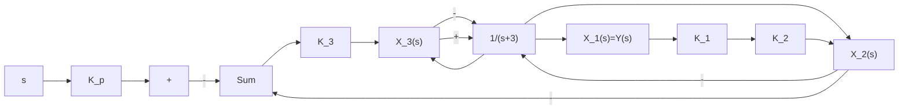
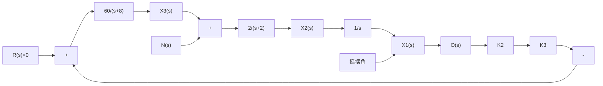
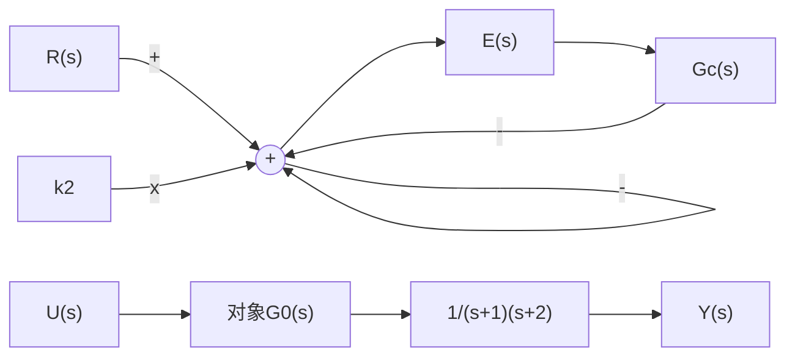

9-41 设内模控制系统如图 9-53 所示。试设计合适的内模控制器 $G_{c}(s)$ 和状态反馈增益向量 $k_{2}$ , 使系统闭环极点 $s_{1} = s_{2} = s_{3} = -2$ , 且对阶跃输入的稳态跟踪误差为零, 最后绘出系统的单位阶跃响应曲线。

flowchart

图 9-51 汽车悬架系统

text_image

侧视图
正视图
游客
驾驶仓
支控
浮桥
电子控制式稳定器

(a)

flowchart

(b)

图 9-52 游船摇摆控制系统  

flowchart

图 9-53 内模控制系统
