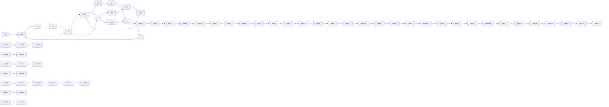

# 9-42 设单位斜坡内模控制系统如图 9-54 所示, 其中被控对象

flowchart

图 9-54 单位斜坡内模控制系统

$$G _ {0} (s) = \frac {1}{(s + 1) (s + 2)}$$

$x_{1}(t)$ 和 $x_{2}(t)$ 为状态变量。试设计合适的内模控制器

$$G _ {c} (s) = \frac {k _ {1} + k _ {2} s}{s ^ {2}}$$

及状态反馈增益 $k_{3}$ 和 $k_{4}$ ，使系统的闭环极点为 $s_1 = s_2 = s_3 = s_4 = -2$ ，且系统对单位斜坡输入的稳态跟踪误差为零，最后绘出系统的单位斜坡响应曲线。

9-43 已知被控对象的动态方程

$$\dot {\boldsymbol {x}} (t) = \boldsymbol {A} \boldsymbol {x} (t) + \boldsymbol {b} \boldsymbol {u} (t)y (t) = \mathbf {c x} (t)$$

其中

$$
\boldsymbol {A} = \left[ \begin{array}{l l} 0 & 1 \\ - 2 & - 2 \end{array} \right], \boldsymbol {b} = \left[ \begin{array}{l} 1 \\ 2 \end{array} \right], \boldsymbol {c} = [ 1 0 ]
$$

要求设计单位斜坡输入时的内模控制器，使系统闭环极点为 $s_{1,2} = -1 \pm j1, s_3 = s_4 = -10$ ，并给出单位斜坡内模控制系统结构图及跟踪误差 $e(t)$ 的响应曲线。

9-44 设单输入-单输出系统的状态空间表达式为

$$\dot {\boldsymbol {x}} (t) = \boldsymbol {A} \boldsymbol {x} (t) + \boldsymbol {b} \boldsymbol {u} (t)y (t) = \mathbf {c x} (t)$$
