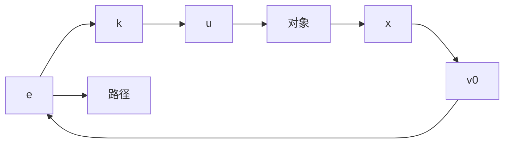

# 1.1 误差反馈控制律与经典 PID 调节器

下面用一个简单的例子来说明误差反馈控制律.

假定被控对象为一阶惯性系统

$$
\left\{ \begin{array}{l} \dot {x} = - a x + u \\ y = x \end{array} \right. \tag {1.1.1}
$$

其传递函数为

$$w (s) = \frac {1}{s + a}$$

这是描述被控对象输入-输出关系的运动方程. 其中, $u$ 是控制输入, $y$ 是系统输出, 是代表我们所感兴趣的实际行为, $x$ 是规定系统运动的状态. 设 $v_{0}$ 是系统行为要达到的期望值, 叫做系统的设定值, 目标值. 假定这个目标值是常数. 这时, $e = v_{0} - y = v_{0} - x$ 是期望值与系统实际行为之间的误差,是设定值与系统输出之间误差.

在这里,我们的目的是:根据期望目标和实际行为之间的误差e来决定控制力u,使系统在这个控制力的作用下,其实际行为 $y(t)=x(t)$ 最终达到设定值 $v_{0}$ ，即最终使误差e趋于零(图1.1.1).

flowchart

图1.1.1

现在,根据误差e,给出如下误差反馈控制力

$$u = k e = k (v _ {0} - x) \tag {1.1.2}$$

即误差大时施加大的作用力,误差小时施加小的作用力,这种形式的控制叫做误差的比例反馈.把这个表达式代到(1.1.1)式,得

$$
\begin{array}{l} \dot {x} = - a x + u = - (k + a) x + k v _ {0} = \\ - (k + a) \left(x - \frac {k}{k + a} v _ {0}\right) \tag {1.1.3} \\ \end{array}
$$

这个系统叫做闭环系统．相对于闭环系统，系统(1.1.1)叫做开环系统.

在式 $(1.1.3)$ 中,令

$$z = x - \frac {k}{k + a} v _ {0}$$

那么式 $(1.1.3)$ 变成

$$\dot {z} = - (k + a) z$$

从而有

$$z (t) = \mathrm{e} ^ {- (k + a) t} z (0)$$

显然, 只要 $(k+a)>0$ (闭环系统将稳定, 其解最终要达到平衡状态), 就有

$$\lim _ {t \rightarrow \infty} z (t) = \lim _ {t \rightarrow \infty} \left(x (t) - \frac {k}{k + a} v _ {0}\right) = 0 \tag {1.1.4}\lim _ {t \rightarrow \infty} x (t) = \frac {k}{k + a} v _ {0} = v _ {0} - \frac {a}{k + a} v _ {0}$$

这里,系统的实际行为 $y(t) = x(t)$ 达到的不是期望的设定值 $v_0$ , 而是比它小 $\left(\frac{a}{k + a}\right)v_0$ 的值, 只要 $a \neq 0$ , 它不会等于零. 偏离期望设定值 $v_0$ 的这个量称做闭环系统的稳态误差或静差, 是闭环系统的很重要的品质指标, 一般称做稳态指标.

从表达式(1.1.4)可以看出加大 $k$ （反馈增益）是能够降低稳态误差的，但是反馈增益只能大到一定程度，再大会出现另一些问题（线性模型只是非线性对象在工作点附近的近似，反馈增益的增大很容易使系统的运动跃出线性近似范围而产生难以驾驭的复杂行为).只要 $a \neq 0$ ，再大的 $k$ 也消除不了稳态误差

确定稳态误差的更直接的方法是让式(1.1.3)的右端等于零（这种状态就是系统的平衡态）而得到的．实际上，系统(1.1.3)是稳定系统，其运动最终是要进入系统的平衡点，而这个平衡点是由方程(1.1.3)的右端等于零来确定．让式(1.1.3)的右端等于零，就能得到

$$x (\infty) = \frac {k}{k + a} v _ {0} = v _ {0} - \frac {a}{k + a} v _ {0}$$

如果在系统(1.1.3)中记 $A = k + a, b = k$ ，那么它可改写成

$$\dot {x} = - A x + b v _ {0}, x (0) = 0 \tag {1.1.5}$$

对给定的常值输入 $v_{0} \neq 0$ ，这个方程的解叫做关于阶跃输入 $v_{0}$ 的响应，特别当 $v_{0} = 1$ 时，这个方程的解称为单位阶跃响应，或简称阶跃响应，显然这个阶跃响应有静差 $\frac{b - A}{A} v_{0}$ .

为了消除这个静差,通常采用再加误差 $e = v_{0} - x$ 的积分 $\int_{0}^{t} e(\tau) \, \mathrm{d}\tau$ 的反馈 $k_{0} \int_{0}^{t} e(\tau) \, \mathrm{d}\tau$ ,使整个误差反馈律变成
