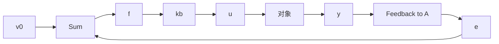

$$u = k e + k _ {0} \int_ {0} ^ {t} e (\tau) \mathrm{d} \tau \tag {1.1.6}$$

这时的闭环系统框图如图 1.1.2 所示.

flowchart

图 1.1.2

闭环系统方程变成

$$\dot {x} = - a x + u = - (k + a) x + k v _ {0} + k _ {0} \int_ {0} ^ {t} e (\tau) \mathrm{d} \tau$$

现在，令

$$e _ {0} (t) = \int_ {0} ^ {t} e (\tau) \mathrm{d} \tau$$

那么

$$\dot {e} _ {0} = e$$

而

$$
\begin{array}{l} \dot {e} = \frac {\mathrm{d}}{\mathrm{d} t} (v _ {0} - x) = \\ - \dot {x} = a x - k e - k _ {0} e _ {0} = \\ a (x - v _ {0}) + a v _ {0} - k e - k _ {0} e _ {0} = \\ - (a + k) e - k _ {0} \left(e _ {0} - \frac {a}{k _ {0}} v _ {0}\right) \\ \end{array}
$$

于是再令 $e_1 = e_0 - \frac{a}{k} v_0$ ，得

$$
\left\{ \begin{array}{l} \dot {e} _ {1} = e \\ \dot {e} = - k _ {0} e _ {1} - (a + k) e \end{array} \right. \tag {1.1.7}
$$

当参数满足 $(a+k)>0,k_{0}>0$ 时,系统稳定,系统的运动最终达

到系统的平衡位置,即

$$e _ {1} (t) \rightarrow 0, e (t) \rightarrow 0$$

因此，就有

$$\lim _ {t \rightarrow \infty} e _ {1} (t) = \lim _ {t \rightarrow \infty} e _ {0} (t) - \frac {a}{k _ {0}} v _ {0} = 0, \lim _ {t \rightarrow \infty} e (t) = v _ {0} - \lim _ {t \rightarrow \infty} x (t) = 0 \tag {1.1.8}$$

于是

$$\lim _ {t \rightarrow \infty} y (t) = \lim _ {t \rightarrow \infty} x (t) = v _ {0} \tag {1.1.9}$$

原闭环系统的静差(稳态误差)现在移到了误差积分分量 $e_{0}$ 上,而使我们所关心的系统的误差(误差积分的微分) $e=v_{0}-x$ 中完全消除了静差 $\frac{a}{a+k}v_{0}$ ,因而系统的实际行为 $y(t)$ 完全到达设定值 $v_{0}$ .

如果系统(1.1.1)中的外扰 $w = w_{0}$ 为常值,那么令

$$e _ {1} = e _ {0} - \frac {a v _ {0} + w _ {0}}{k _ {0}}$$

闭环系统仍为(1.1.7).

因此

$$\lim _ {t \to \infty} e _ {1} (t) = \lim _ {t \to \infty} e _ {0} (t) - \frac {a v _ {0} + w _ {0}}{k _ {0}} = 0,\lim _ {t \rightarrow \infty} e (t) = v _ {0} - \lim _ {t \rightarrow \infty} x (t) = 0$$

因此

$$\lim _ {t \rightarrow \infty} e _ {0} (t) = \frac {a v _ {0} + w _ {0}}{k _ {0}}, \lim _ {t \rightarrow \infty} x (t) = v _ {0}$$

静差还是移到了误差积分项上,而系统输出 $y(t)=x(t)$ 则完全达到设定值 $v_{0}$ .

如果在系统(1.1.7)中记 $A_{0}=k_{0},A_{1}=a+k,b=a$ ，那么它6

变成

$$
\left\{ \begin{array}{l l} \dot {e} _ {0} = e, & e _ {0} (0) = 0 \\ \dot {e} = - A _ {0} e _ {0} - A _ {1} e + b v _ {0}, & e (0) = v _ {0} \\ y = v _ {0} - e \end{array} \right. \tag {1.1.10}
$$

这就是对一阶惯性环节加上误差的比例 - 积分反馈之后, 对阶跃输入 $v_{0}$ 的阶跃响应所应满足的微分方程组. 积分反馈的引入能够消除阶跃输入和常值扰动产生的稳态误差.

下面再来看看二阶对象的情形.

假定有二阶振荡环节：

$$
\left\{ \begin{array}{l} \ddot {x} = - a _ {1} x - a _ {2} \dot {x} + w + u \\ y = x \end{array} , \right.
$$
