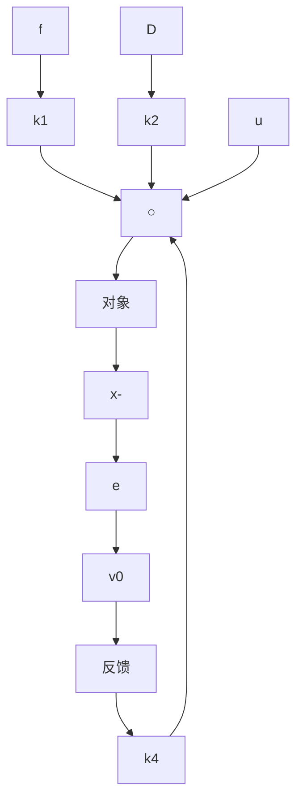

图1.1.3

现在，又令

$$e _ {0} (t) = \int_ {0} ^ {t} e (\tau) \mathrm{d} \tau$$

那么

$$\dot {e} _ {0} = e,\ddot {e} = \frac {\mathrm{d} ^ {2}}{\mathrm{d} t ^ {2}} (v _ {0} - x) = - \dddot {x} = a _ {1} x + a _ {2} \dot {x} - k _ {1} e - k _ {2} \dot {e} - k _ {0} e _ {0} =a _ {1} (x - v _ {0}) + a _ {1} v _ {0} + a _ {2} \dot {x} - k _ {1} e - k _ {2} \dot {e} - k _ {0} e _ {0} =- \left(a _ {1} + k _ {1}\right) e + \left(a _ {2} + k _ {2}\right) \dot {e} - k _ {0} \left(e _ {0} - \frac {a _ {1}}{k _ {0}} v _ {0}\right) (\text {因} \dot {v} _ {0} = 0)$$

于是得如下闭环系统

$$
\left\{ \begin{array}{l l} \dot {e} _ {0} = e, & e _ {0} (0) = 0 \\ \ddot {e} = - \left(k _ {1} + a _ {1}\right) e - \left(k _ {2} + a _ {2}\right) \dot {e} - k _ {0} \left(e _ {0} - \frac {a _ {1}}{k _ {0}} v _ {0}\right), & e (0) = v _ {0} \end{array} \right. \tag {1.1.15}
$$

此系统的实际输出(实际行为)为

$$y (t) = x (t) = v _ {0} - e (t)$$

根据三阶线性定常系统稳定性条件,只要满足

$$k _ {0} > 0, \left(k _ {1} + a _ {1}\right) > 0, \left(k _ {2} + a _ {2}\right) > 0,$$

且 $(k_{1}+a_{1})(k_{2}+a_{2})>k_{0}$ (1.1.16)

就有

$$\lim _ {t \rightarrow \infty} e _ {0} (t) = \frac {a _ {1}}{k _ {0}} v _ {0}, \lim _ {t \rightarrow \infty} e (t) = 0, \lim _ {t \rightarrow \infty} e (t) = 0 \Rightarrow \lim _ {t \rightarrow \infty} y (t) = v _ {0}$$

在系统(1.1.15)中记 $A_{0}=k_{0},A_{1}=k_{1}+a_{1},A_{2}=k_{2}+a_{2},b=a_{1}$ ，那么它变成

$$
\left\{ \begin{array}{l l} \dot {e} _ {0} = e _ {1}, & e _ {0} (0) = 0 \\ \dot {e} _ {1} = e _ {z}, & e _ {1} (0) = v _ {0} \\ \dot {e} _ {2} = - A _ {0} e _ {0} - A _ {1} e _ {1} - A _ {2} e _ {2} + b v _ {0}, & e _ {2} (0) = 0 \\ y = v _ {0} - e _ {1} \end{array} \right. \tag {1.1.17}
$$

这就是对二阶振荡环节加上误差的比例 - 积分 - 微分反馈之后所得闭环系统的微分方程组．显然，这个系统稳定的充分必要条件（三次多项式稳定的条件）为

$$A _ {0} > 0, A _ {1} > 0, A _ {2} > 0 \text {, 且} A _ {1} A _ {2} > A _ {0} \tag {1.1.18}$$

如果系统(1.1.11)中的外扰 $w = w_{0}$ 为常值,那么闭环系统(1.1.17)变成

$$
\left\{ \begin{array}{l} \dot {e} _ {0} = e \\ \ddot {e} = - (a _ {1} + k _ {1}) e - (a _ {2} + k _ {2}) \dot {e} - k _ {0} \left(e _ {0} - \frac {a _ {1} v _ {0} + w _ {0}}{k _ {0}}\right) \end{array} \right.
A _ {0} > 0, A _ {1} > 0, A _ {2} > 0
$$

因此仍有

$$\lim _ {t \rightarrow \infty} e (t) = 0, \lim _ {t \rightarrow \infty} y (t) = v _ {0} - \lim _ {t \rightarrow \infty} e (t) = v _ {0}$$

反馈律(1.1.14)

$$u = k _ {0} \int_ {0} ^ {t} e (\tau) \mathrm{d} \tau + k _ {1} e + k _ {2} \dot {e} \tag {1.1.19}$$
