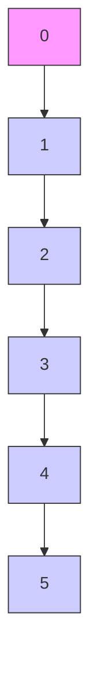

text_image

u₁
u₂
u₃
u₄
0 1 2 3 4 5

图 1.4.10

把这些函数分别送入一,二,三,四阶积分器串联型系统,令系统的初始状态都取0而积分,就得到安排的过渡过程及其相应各阶的微分信号(图1.4.11).

flowchart

图 1.4.11

对于五阶对象,把按下面公式定义的方波函数

$$u _ {5} = s (t - 0. 0 9 5 4 7 5 T _ {0}, T _ {0}) \times s (t - 0. 3 4 5 4 7 5 T _ {0}, T _ {0}) \timess (t - 0. 6 5 4 5 2 5 T _ {0}, T _ {0}) \times s (t - 0. 9 0 4 5 2 5 T _ {0}, T _ {0})$$

送入五阶积分器串联型系统,积分得到安排的过渡过程及其一、二、三、四阶微分信号.这些信号的曲线图如图1.4.12所示.

line

| X | Y |
| --- | --- |
| 0 | 0.6 |
| 1 | -0.2 |
| 2 | -0.4 |
| 3 | 0.6 |
| 4 | -0.2 |
| 5 | 0.6 |
| 6 | -0.2 |
| 7 | -0.2 |

图1.4.12

对 $n(n \geqslant 2)$ 阶系统, 在区间 $[0, T_{0}]$ 上, 安排无超调过渡过程的基本原则:

在 $[0,T_{0}]$ 上定义如下性质的函数 $u_{n}(t)$ :

(1) 开始取正值, 当 $t \geqslant T_{0}$ 时, $u_{n}(t) \equiv 0$ , 在区间 $(0, T_{0})$ 内要变 n - 1 次符号.  
(2) $u_{n}(t)$ 的1次积分函数在 $(0,T_{0})$ 内要变n-2次符号；2次积分函数要变n-3次符号；……； $m(m\leqslant n-2)$ 次积分函数变 $n-(m+1)$ 次符号.  
(3) $u_{n}(t)$ 及其直到n-2次的积分函数(也是安排的过渡过程的2次及以上各阶导数)，其正部分面积和负部分的面积相等.这个条件保证 $u_{n}(t)$ 及其直到n-1次的积分函数(也是过渡过程的各阶导数)在区间 $(0,T_{0})$ 之外恒等于零.

这时， $u_{n}(t)$ 的 n-1 次积分函数在区间 $(0, T_{0})$ 上取正值， $(0, T_{0})$ 之外保持零，而其积分将从零开始单调上升，到 $T_{0}$ 时刻以后保持恒定值，从而 $u_{n}(t)$ 的 n 次积分给出无超调的过渡过程.

如果满足上述条件的 $u_{n}(t)$ 是以固定幅值 $r$ 的方波函数，那么函数 $u_{n}(t)$ 是最速控制问题

$$
\left\{ \begin{array}{l l} x ^ {(n)} = u, & | u | \leqslant r \\ x ^ {(i)} (0) = 0, & i = 1, \dots , n - 1 \\ x \left(T _ {0}\right) = v _ {0} > 0, & x ^ {(i)} \left(T _ {0}\right) = 0, i = 2, \dots , n - 1 \\ \min T _ {0} \end{array} \right.
$$

的最速控制函数.

另外更为直接而简单的办法是求解传递关系

$$y = w (s) v _ {0} = \frac {r ^ {2}}{(s - r) ^ {n}} v _ {0}$$

来决定．此传递函数的状态变量实现为

$$
\left\{ \begin{array}{l} v _ {1} = v _ {2} \\ \cdot \\ v _ {2} = v _ {3} \\ \vdots \\ v _ {n - 1} = v _ {n} \\ v _ {n} = - r (\dots r (r (r (v _ {1} - v _ {0}) + C _ {n} ^ {2} v _ {2}) + C _ {n} ^ {3} v _ {3}) + \dots + C _ {n} ^ {n} v _ {n}) \end{array} \right.
$$
