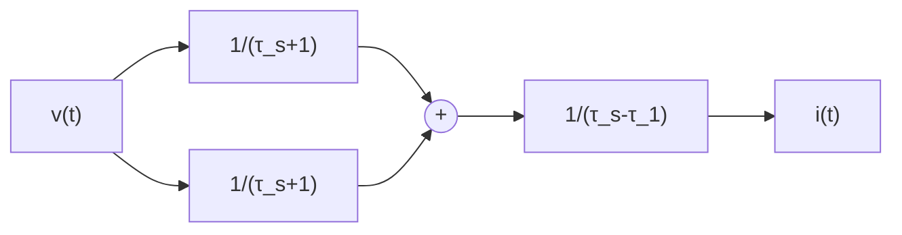

$$\dot {v} (t) \approx \frac {v (t - \tau_ {1}) - v (t - \tau_ {2})}{\tau_ {2} - \tau_ {1}}, 0 < \tau_ {1} < \tau_ {2} \tag {2.2.8}$$

而且延迟信号 $v(t - \tau_1)$ 和 $v(t - \tau_2)$ 分别将由惯性环节 $1 / (\tau_1s + 1)$ 和 $1 / (\tau_2s + 1)$ 来获取，那么可以降低噪声放大效应．式(2.2.8)的等价方框图为图2.2.2.这个微分近似公式的传递函数为

$$y = \frac {1}{\tau_ {2} - \tau_ {1}} \left(\frac {1}{\tau_ {1} s + 1} - \frac {1}{\tau_ {2} s + 1}\right) v =\frac {s}{\tau_ {1} \tau_ {2} s ^ {2} + (\tau_ {1} + \tau_ {2}) s + 1} v \tag {2.2.9}$$

flowchart

图2.2.2

等价的状态变量实现为

$$
\left\{ \begin{array}{l} \dot {x} _ {1} = x _ {2} \\ \dot {x} _ {2} = - \frac {1}{\tau_ {1} \tau_ {2}} (x _ {1} - v (t)) - \frac {\tau_ {1} + \tau_ {2}}{\tau_ {1} \tau_ {2}} x _ {2} \\ y = x _ {2} \end{array} \right. \tag {2.2.10}
$$

下面比较传递关系(2.2.2)和(2.2.9)确定的微分信号.

为了便于计算, 把传递函数(2.2.2) 和(2.2.9) 相对应的时域方程分别离散化成

$$
\left\{ \begin{array}{l} \bar {v} (k + 1) = \bar {v} (k) - h \frac {1}{T} (\bar {v} (k) - v (k)) \\ y _ {1} (k) = \frac {1}{T} (v (k) - \bar {v} (k)) \end{array} \right. \tag {2.2.11}

\left\{ \begin{array}{l} x _ {1} (k + 1) = x _ {1} (k) + h x _ {2} (k) \\ x _ {2} (k + 1) = x _ {2} (k) - h \left(\frac {1}{\tau_ {1} \tau_ {2}} \left(x _ {1} (k) - v (k)\right) + \frac {\tau_ {1} + \tau_ {2}}{\tau_ {1} \tau_ {2}} x _ {2} (k)\right) \\ y _ {2} (k) = x _ {2} (k) \end{array} \right. \tag {2.2.12}
$$

式中：h 为积分步长； $x(k)$ 为函数 $x(t)$ 在 kh 时刻的值.

现在对这两个离散系统都输入被噪声污染的正弦信号

$$v (t) = \sin (t) + \gamma n (t) \tag {2.2.13}$$

式中： $n(t)$ 为 $[-1,1]$ 上均匀分布的白噪声.

上述三个惯性环节的时间常数, 噪声强度和积分步长分别取为

$$\tau = \tau_ {1} = 0. 0 1, \tau_ {2} = 0. 0 2, \gamma = 0. 0 1, h = 0. 0 0 1$$

图2.2.3和图2.2.4分别显示了方程(2.2.11)和方程(2.2.12)确定的微分信号.

line

| x | y |
| --- | --- |
| 0 | 1.0 |
| 5 | -1.0 |
| 10 | 0.8 |
| 15 | -1.0 |
| 20 | 1.0 |

line

| x | y |
| --- | --- |
| 0 | 2.0 |
| 5 | 0.5 |
| 10 | -1.5 |
| 15 | 0.5 |
| 20 | 2.0 |

图 2.2.3  

line

