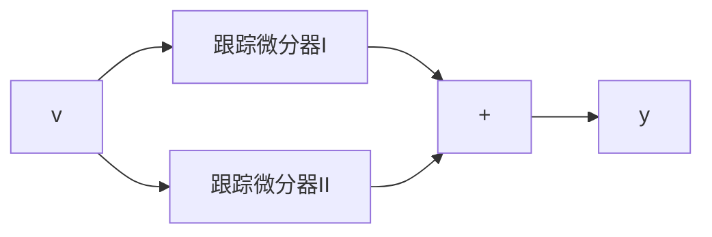

# 2.5.2 带通滤波器

利用TD的上述特性,我们很容易构造出数字带通滤波器.一定频率范围的信号是能通过的,而这个范围之外的高频和低频信号都不能通过的滤波器叫做带通滤波器.利用TD可按图2.5.4方式构造出带通滤波器:把两个TD并联,而其两个输出相减.

flowchart

图2.5.4

这里，跟踪微分器Ⅰ中用的速度因子 $r_{1}$ 和跟踪微分器Ⅱ中用的速度因子 $r_{2}$ 将满足不等式 $r_{2}<r_{1}$ . 这个系统的幅频特性如图2.5.5所示.

例 几种频率合成的信号中,要把低频部分和高频部分去掉.现有信号

$$v (t) = a _ {1} \sin (\omega_ {1} t) + a _ {2} \sin (\omega_ {2} t) + a _ {3} \sin (\omega_ {3} t)$$

取 $a_1 = a_2 = a_3 = 1, \omega_1, \omega_2, \omega_3$ 分别取0.3, 10, 100. 要设计出只能通过信号 $v_2(t) = a_2\sin (\omega_2t)$ 的带通滤波器. 当两个TD的快速因子和滤波因子分别取成 $r_1 = 5, r_2 = 0.01, h = 0.1$ 而输入上述信号$v(t)$ 时，中频 $\sin (\omega_2t)$ 和高频部分 $\sin (\omega_3t)$ 将被全部滤掉，只剩下低频部分 $\sin (\omega_1t)$ 了(图2.5.6).而当取 $r_1 = 200,r_2 = 130,h =$ 0.02时只剩中频部分的 $\sin (\omega_2t)$ 了(图2.5.7).

line

| lg(ω) | Value |
| --- | --- |
| 0.6 | -25 |
| 0.8 | -20 |
| 1.0 | 0 |
| 1.2 | -5 |
| 1.4 | -15 |
| 1.6 | -25 |
| 1.8 | -28 |
| 2.0 | -30 |

图 2.5.5

line

| x | y |
| --- | --- |
| 0 | 1.0 |
| 5 | 0.8 |
| 10 | 0.6 |
| 15 | -0.2 |
| 20 | -0.6 |
| 25 | -0.8 |
| 30 | -1.0 |

图2.5.6  

line

| x | y |
| --- | --- |
| 5.5 | 1 |
| 6.0 | -1 |
| 6.5 | 0 |
| 7.0 | 1 |
| 7.5 | -1 |
| 8.0 | 0 |
| 8.5 | 1 |
| 9.0 | -1 |
| 9.5 | 0 |
| 10.0 | 1 |

图2.5.7

如果快速因子分别取成 $r_{1}=10000, r_{2}=6000, h_{1}=0.001, h_{2}=0.003$ 时，其中 $h_{1}, h_{2}$ 分别表示跟踪微分器 I、II 的步长。低频中频全被滤掉，只剩高频部分 $\sin(\omega_{3}t)$ 了（图 2.5.8）。

line

r = 10000, r = -6000, R = 0.001, K = 0.003
v = sin(100)
v = sin(0.3r) + sin(10r) + sin(100r)

图2.5.8
