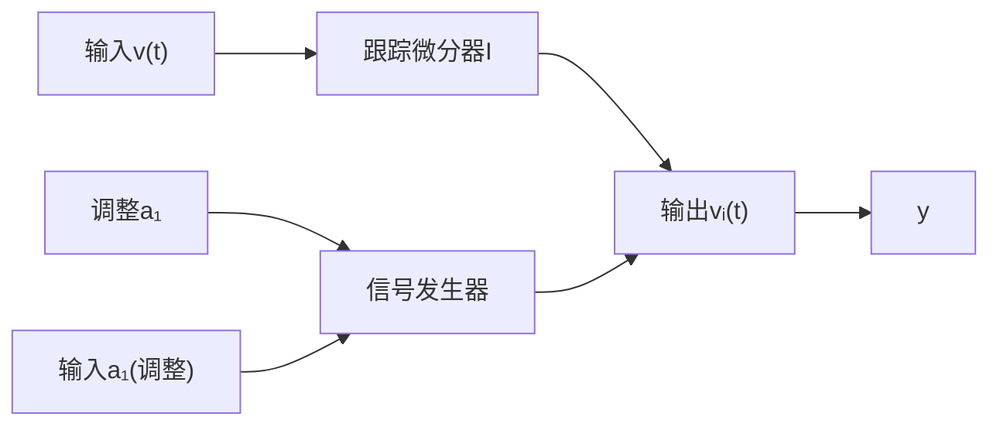

# 2.6.6 相近频率的分离

如果两个频率 $\omega_{1}, \omega_{2}$ 比较接近，如何分开它们？用前述的滤波方法是很难区分的，但是如果有一个频率是事前知道的，如 $\omega_{1}$ 已知，那么我们可以从信号 $v(t) = a_{1}\sin(\omega_{1}t) + a_{2}\sin(\omega_{2}t)$ 中分离出频率 $\omega_{2}$ 。记 $v_{1}(t) = a_{1}\sin(\omega_{1}t), v_{2}(t) = a_{2}\sin(\omega_{2}t), v(t) = v_{1}(t) + v_{2}(t)$ 。

事实上，已知信号是满足微分方程

$$
\left\{ \begin{array}{l l} \dot {x} _ {1 1} = x _ {1 2}, & x _ {1 1} (0) = 0 \\ \dot {x} _ {1 2} = - \omega_ {1} ^ {2} x _ {1 1}, & x _ {1 2} (0) = a _ {1} \omega_ {1} \end{array} \right. \tag {2.6.20}
$$

的解,因此把信号 $v(t)$ 送入跟踪微分器

$$
\left\{ \begin{array}{l} \mathrm{fs} = \operatorname{fhan} (x _ {2 1} - v, x _ {2 2}, r, h) \\ \dot {x} _ {2 1} = x _ {2 2}, x _ {2 1} (0) = 0 \\ \dot {x} _ {2 2} = \mathrm{fs}, x _ {2 2} (0) = 0 \end{array} \right. \tag {2.6.21}
$$

让 $x_{21}(t)$ 跟踪 $\pmb {v}(t)$ ，则有

$$x _ {2 1} (t) \rightarrow v (t),$$

然后,适当调整 $a_{1}$ 来求解微分方程

$$
\left\{ \begin{array}{l l} \dot {x} _ {1 1} = x _ {1 2}, & x _ {1 1} (0) = 0 \\ \dot {x} _ {1 2} = - \omega_ {1} ^ {2} x _ {1 1}, & x _ {1 2} (0) = a _ {1} \omega_ {1} \end{array} \right. \tag {2.6.22}
$$

得信号 $v_{1}(t)$ . 这两者相减可得 $v_{2}(t)$ 了

$$x _ {2 1} (t) - x _ {1 1} (t) \rightarrow v (t) - v _ {1} (t) \rightarrow v _ {2} (t)$$

我们把微分方程

$$
\left\{ \begin{array}{l l} \dot {x} _ {1 1} = x _ {1 2}, & x _ {1 1} (0) = 0 \\ \dot {x} _ {1 2} = - \omega_ {1} ^ {2} x _ {1 1}, & x _ {1 2} (0) = a _ {1} \omega_ {1} \end{array} \right. \tag {2.6.23}
$$

作为信号发生器,那么上述过程可以按图2.6.10的方式实现.

flowchart

图 2.6.10

按上述方法仿真的结果示于图2.6.11，图2.6.11(a)是两个频率符合的信号，图2.6.11(b)是已知频率信号，而图2.6.11(c)是未知频率信号.
