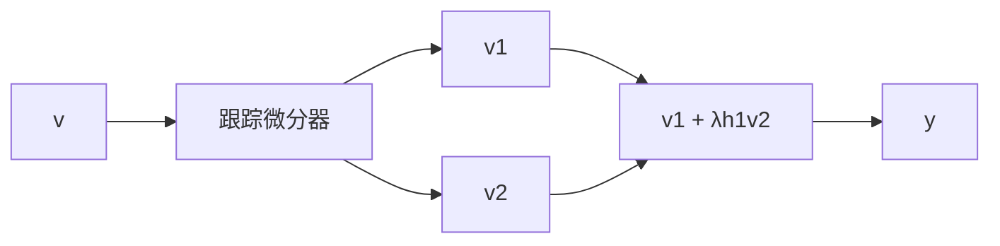

# 2.6.9 相位超前功能的实现

利用跟踪微分器, 可以按图 2.6.16 方式来实现相位超前功能.

flowchart

图2.6.16

其具体算法为

$$
\left\{ \begin{array}{l} \mathrm{fh} = \mathrm{fhan} (v _ {1} - v (t), v _ {2}, r, h _ {1}) \\ v _ {1} = v _ {1} + h v _ {2} \\ v _ {2} = v _ {2} + h \mathrm{fh} \end{array} \right. \tag {2.6.24}
\gamma (t) = \frac {1}{\gamma} (v _ {1} (t) + \lambda h _ {1} v _ {2} (t)), \gamma > 1
$$

参数取值和输入函数如下：

$$h = h _ {1} = 0. 0 1, v _ {1} (t) = \sin (t), \lambda = 1 1 0, \gamma = 1. 5$$

所作仿真结果显示于图 2.6.17. 参数 $\lambda$ 小, 超前的相位会小.

line

| x | y(t) | u(t), v(t) |
| --- | --- | --- |
| 0 | 1.0 | 0.0 |
| 1 | 0.5 | 0.5 |
| 2 | 0.0 | 1.0 |
| 3 | -0.5 | 0.5 |
| 4 | -1.0 | 0.0 |
| 5 | -0.5 | -0.5 |
| 6 | 0.0 | -1.0 |
| 7 | 0.5 | -0.5 |
| 8 | 1.0 | 0.0 |
| 9 | 0.5 | 0.5 |
| 10 | 0.0 | 1.0 |

图2.6.17
