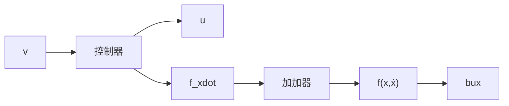

# 3.4 状态反馈方法与误差反馈方法

以上主要讨论的是利用“状态反馈”改造原开环“全局动态特性”来实现控制目的的方法.

在经典控制理论时期,发展了把对象的开环线性传递特性用状态反馈改造成期望的闭环传递特性来实现控制目的的理论与设计方法. 以状态变量描述为工具的现代线性控制系统理论是把上述传递特性的改造过程转化为用状态反馈实现极点配置等问题.

这是开环全局动态特性的改造来实现控制目的的过程，于是确立了改造全局动态特性来实现控制目的现代控制理论研究方法。既然立足于全局动态特性的改造，就得借用整个经典的和现代的研究动力学系统理论的数学工具。于是线性空间、微分几何、拓扑学等数学工具涌入了控制理论研究中，发展构筑了丰富多彩的以控制系统问题为背景的控制数学理论大厦。

在这里,采用的主要手段是状态反馈,要解决的关键问题是被改造了的闭环动态特性的稳定性问题.

以二阶被控对象为例,实现控制目的的这种方法的信息流程图如图3.4.1所示.

flowchart

图3.4.1

这里的控制器需要利用决定开环动态的函数 $f(x,\dot{x})$ 、状态变量x, $\dot{x}$ 和控制目标 $v(t)$ 。这种研究方法需要知道关于原开环动态特性的知识和状态变量的知识，于是在这里数学模型的认知是不可缺的前提。这在许多控制工程实际中是很不现实的，因为工程实际提供不了开环动态特性的多少先验知识，因此这种全局性的改造方法给出的结果很难在实际中得到应用。

这就是现代控制理论成果与工程实际脱节的主要原因.

实际上, 实现控制目的不一定需要事先知道开环动态特性——数学模型. 例如, 对二阶对象

$$
\left\{ \begin{array}{l} \ddot {x} = f (x, \dot {x}) + u \\ y = x \end{array} \right. \tag {3.4.1}
$$

来说,要实现控制目的不一定需要知道函数 $f(x,\dot{x})$ 和系统状态变量 $x,\dot{x}$ .

实现控制目的主要是在系统运行过程中施加适当控制力把目标 $v(t)$ 与被控输出 $y(t)$ 之间的误差 e = v - y 衰减下去. 为此, 只需明了开环动态在控制过程中的实时表现量

$$a (t) = f (x (t), \dot {x} (t)) \tag {3.4.2}$$

就够了. 这个过程的表现量可以表示成

$$a (t) = \ddot {x} (t) - u (t) \tag {3.4.3}$$

这说明,量 $a(t)$ 是利用系统的输入 $u(t)$ 和输出 $y(t) = x(t)$ 可以提炼出来的.

如果能够获取运行过程中的量 $a(t)$ ，则把控制量取成

$$u (t) = - a (t) + u _ {0} \tag {3.4.4}$$

那么控制过程的微分方程变成

$$\ddot {y} (t) = u _ {0} \tag {3.4.5}$$

然后把控制量 $u_{0}$ 再取成误差 e 的反馈, 比如(也可以采用效率更高的其他形式反馈)

$$u _ {0} (t) = - a _ {1} e - a _ {2} \dot {e} + \ddot {v} (t), a _ {1} > 0, a _ {2} > 0 \tag {3.4.6}$$

闭环过程的微分方程最后变成

$$\ddot {e} (t) = - a _ {1} e - a _ {2} \dot {e} \tag {3.4.7}$$

显然这个微分方程是稳定的,从而有 $e(t) \Rightarrow 0$ , 于是可以达到控制目的: $y(t) \Rightarrow v(t)$ .

本书主要围绕采用“误差反馈”的“过程的控制”方法来介绍研发与工程实用控制器相关的各种问题.

在这里,最速反馈函数有其特殊的功能.为此有必要进一步了解最速反馈函数的有关性质.
