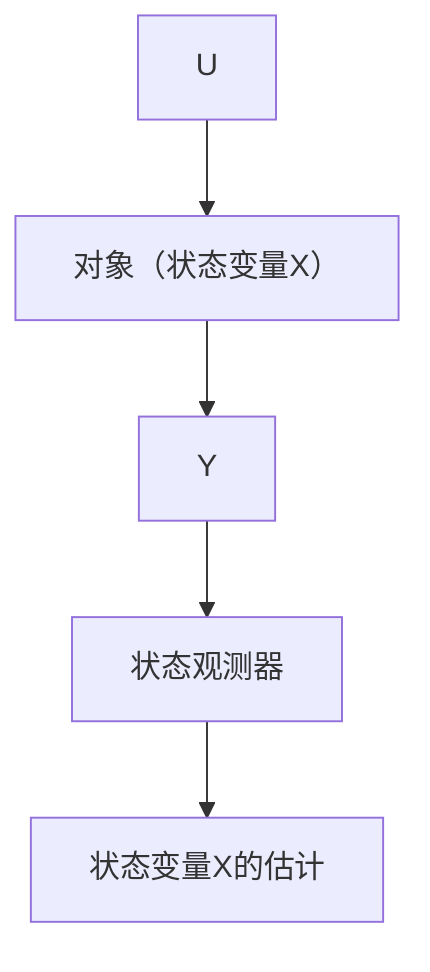

# 4.1 状态观测器

系统在运行过程中总是与环境进行信息交流. 系统把某些部分状态变量信息传给外部, 也从外部吸入一些信息, 即系统是与外部进行信息交流的过程中变化发展. 人们只能收集系统外部变量来把握系统运行状况. 对于动态过程而言, 系统外部变量就是系统传给外部的输出变量——部分状态变量信息和外部给系统的输入变量, 包括控制输入. 根据这种外部变量的观测来确定系统内部状态变量的装置叫做状态观测器, 即根据量测到的系统输入(控制量)和系统输出(部分状态变量或状态变量的函数)来确定系统所有内部状态信息的装置就是状态观测器(图4.1.1).

flowchart

图4.1.1

对线性控制系统

$$
\left\{ \begin{array}{l} \dot {\boldsymbol {X}} = \boldsymbol {A} \boldsymbol {X} + \boldsymbol {B} \boldsymbol {U} \\ \boldsymbol {Y} = C X \end{array} \right. \tag {4.1.1}
$$

来说，X 是 n 维状态变量，U 和 Y 分别是 p 维、q 维向量，通常 q < n. p < n. 以对象的输出量 Y 和输入量 U 做为其输入，可构造出如下新系统

$$
\begin{array}{l} \dot {\mathbf {Z}} = \mathbf {A} \mathbf {Z} - \mathbf {L} (\mathbf {C Z} - \mathbf {Y}) + \mathbf {B U} = \\ (A - L C) Z + L Y + B U \tag {4.1.2} \\ \end{array}
$$

式中：L 为要适当选取的矩阵. 这是用对象的输出量 Y 和输入量 U 来设计出的新系统. 今令这两个系统状态变量的误差记为 e = Z - X, 则上面两个方程组相减, 得误差变量 e 所满足的方程组

$$\dot {e} = (A - L C) e \tag {4.1.3}$$

这里只要取矩阵 L, 使矩阵

$$(A - L C) \tag {4.1.4}$$

稳定(系统 $(A,C)$ 的能观性保证这样的L存在)，就有 $e\Rightarrow0$ ，从而 $Z\Rightarrow X$ 。新设计的系统(4.1.2)的状态Z就是能近似地估计出原系统(4.1.1)的所有状态变量X。因此，当条件(4.1.4)得到满足时，把新建的系统(4.1.2)称做原系统(4.1.1)的状态观测器。这个状态观测器(4.1.2)也可以改写成

$$
\left\{ \begin{array}{l} e = C Z - Y \\ \dot {Z} = A Z - L e + B U \end{array} \right. \tag {4.1.5}
$$

式中：e 为系统的输出误差。因此状态观测器是用输出误差的“反馈”来改造原系统而构造出来的新系统。

下面具体看看特殊的二阶系统的状态观测器的具体形式. 设有二阶线性控制系统

$$
\left\{ \begin{array}{l} \dot {x} _ {1} = x _ {2} \\ \dot {x} _ {2} = a _ {1} x _ {1} + a _ {2} x _ {2} + b u \\ y = x _ {1} \end{array} \right. \tag {4.1.6}
$$

对这个系统

$$
\boldsymbol {A} = \left[ \begin{array}{l l} 0 & 1 \\ a _ {1} & a _ {2} \end{array} \right], \boldsymbol {B} = \left[ \begin{array}{l} 0 \\ b \end{array} \right], \boldsymbol {C} = [ 1 0 ], \boldsymbol {L} = \left[ \begin{array}{l} l _ {1} \\ l _ {2} \end{array} \right]
$$

因此

$$
\boldsymbol {L} \boldsymbol {C} = \left[ \begin{array}{l l} l _ {1} & 0 \\ l _ {2} & 0 \end{array} \right], \boldsymbol {A} \boldsymbol {Z} - \boldsymbol {L} e _ {1} = \left[ \begin{array}{c} z _ {2} - l _ {1} e _ {1} \\ a _ {1} z _ {1} + a _ {2} z _ {2} - l _ {2} e _ {1} \end{array} \right]
$$

根据式(4.1.5)，对应于这个系统的状态观测器形式为
