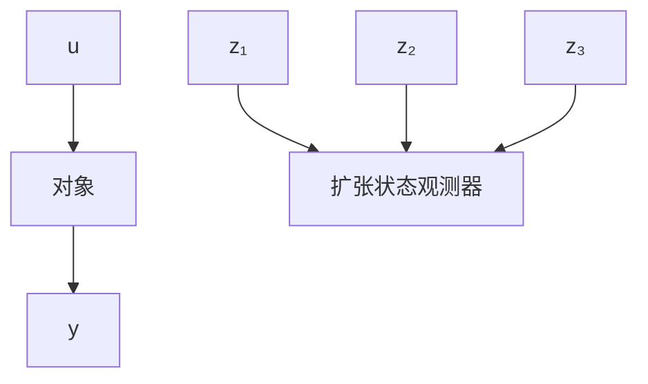

# 4.3 扩张状态观测器

既然非线性状态观测器

$$
\left\{ \begin{array}{l} e _ {1} = z _ {1} - y \\ \dot {z} _ {1} = z _ {2} - \beta_ {0 1} e _ {1} \\ \dot {z} _ {2} = - \beta_ {0 2} | e _ {1} | ^ {\frac {1}{2}} \text {sign} (e _ {1}) + b u \end{array} \right. \tag {4.3.1}
$$

对非线性系统

$$
\left\{ \begin{array}{l} x _ {1} = x _ {2} \\ \dot {x} _ {2} = f (x _ {1}, x _ {2}) + b u \\ y = x _ {1} \end{array} \right. \tag {4.3.2}
$$

的状态 $x_{1}(t), x_{2}(t)$ 进行很好地跟踪，我们把作用于开环系统的加速度 $f(x_{1}(t), x_{2}(t))$ 的实时作用量扩充成新的状态变量 $x_{3}$ ，记作

$$x _ {3} (t) = f \left(x _ {1} (t), x _ {2} (t)\right) \tag {4.3.3}$$

并记 $\dot{x}_{3}(t)=w(t)$ ，那么系统(4.3.2)可扩张成新的线性控制系统

$$
\left\{ \begin{array}{l} \dot {x} _ {1} = x _ {2} \\ \dot {x} _ {2} = x _ {3} + b u \\ \dot {x} _ {3} = w (t) \\ y = x _ {1} \end{array} \right. \tag {4.3.4}
$$

按式 $(4.1.23)$ 对这个被扩张的系统建立状态观测器

$$
\left\{ \begin{array}{l} e _ {1} = z _ {1} - y \\ \dot {z} _ {1} = z _ {2} - \beta_ {0 1} e _ {1} \\ \dot {z} _ {2} = z _ {3} - \beta_ {0 2} \mid e _ {1} \mid^ {\frac {1}{2}} \operatorname{sign} \left(e _ {1}\right) + b u \\ \dot {z} _ {3} = - \beta_ {0 3} \mid e _ {1} \mid^ {\frac {1}{4}} \operatorname{sign} \left(e _ {1}\right) \end{array} \right. \tag {4.3.5}
$$

则只要适当选择参数 $\beta_{01}, \beta_{02}, \beta_{03}$ ，这个系统也能很好地估计系统（4.3.4）的状态变量 $x_{1}(t), x_{2}(t)$ 及被扩张的状态的实时作用量 $x_{3}(t) = f(x_{1}(t), x_{2}(t))$ ，即

$$z _ {1} (t) \rightarrow x _ {1} (t), z _ {2} (t) \rightarrow x _ {2} (t) \tag {4.3.6}$$

并且有

$$z _ {3} (t) \rightarrow x _ {3} (t) = f \left(x _ {1} (t), x _ {2} (t)\right) \tag {4.3.7}$$

如果函数 $f(x_{1},x_{2})$ 中含有时间变量t和未知扰动作用 $w(t)$ ，那么同样，令

$$x _ {3} (t) = f \left(x _ {1} (t), x _ {2} (t), t, w (t)\right) \tag {4.3.8}$$

则从观测器(4.3.5)同样可以得到状态变量 $x_{1}(t),x_{2}(t)$ 的估计 $z_{1}(t),z_{2}(t)$ ，而且还能估计出被扩张的状态变量－作用于系统的加速度的实时作用量

$$a (t) = f \left(x _ {1} (t), x _ {2} (t), t, w (t)\right) \tag {4.3.9}$$

我们把被扩张的系统的状态观测器(4.3.5)称为系统(4.3.2)的扩张状态观测器(Extended State Observer, ESO), 而变量 $x_{3}(t)$ 称作被扩张的状态.

扩张状态观测器是一个动态过程,它只用了原对象的输入-输出信息,没有用到描述对象传递关系的函数f的任何信息,其结构图如图4.3.1所示.

flowchart

图4.3.1

对扩张状态观测器(4.3.5)来说,估计如下三种类型系统
