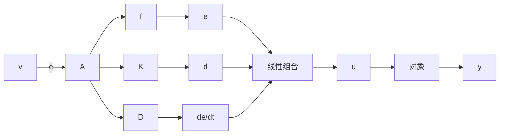
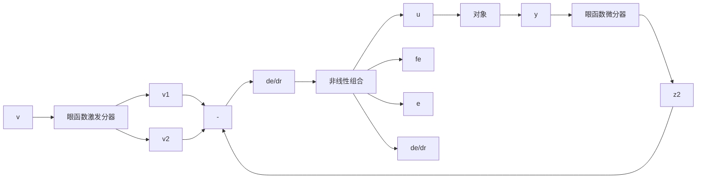

# 5.1.1 经典PID控制器的缺陷

先看看经典 PID 控制器结构及它所固有的一些缺陷．经典

PID 是实现“用误差反馈来消除误差”原理的最原始的控制器结构, 其框图如图 5.1.1 所示.

flowchart

图 5.1.1

这是根据控制目标即设定值 $v$ 与系统被控输出 $y$ 之间的误差 $e$ ，这个误差信号的微分信号 $\dot{e}$ 及其积分信号 $\int_0^d e(\tau)\mathrm{d}\tau$ 的加权和来生成驾驭被控对象的控制量 $u$ 的办法，是至今仍在控制工程实践中大量被应用的基本控制器结构．但是，在大量的控制工程实践中，这种最简单的PID控制器结构逐渐显露出其固有的缺陷.

经典 PID 控制器结构的缺陷可归结为如下四个方面：

(1) 对象的被控输出 $y$ 是动态环节的输出, 有一定的惯性, 其变化不可能跳变. 但是设定值 $v$ 是由系统外部给定的, 可以跳变. 直接采用它们之间的误差信息 $e = v - y$ 来消除这个误差, 就意味着让不可能跳变的量 $y$ 来跟踪可以跳变的量 $v$ , 这是一个不合理的要求.  
(2) PID 控制中要用误差的微分信号 $\dot{e}$ . 但是过去没有提取微分信号的合理办法和合适装置, 因此不能充分发扬误差微分的反馈作用.  
(3) 在 PID 中的误差反馈律是误差的现在 (P)、过去 (I)、将来（变化趋势 (D)）的加权和（线性组合）。显然这些量的线性组合不一定是最合适的组合形式，可以在非线性范围内寻求更合适、更有效率的组合形式。  
(4) 大量控制工程实践表明,经典 PID 控制中的误差积分反馈的应用,对抑制常值扰动的作用是显著的,然而常常使闭环系统的反应迟钝、容易产生振荡和控制量饱和等的负作用.

对于这四个方面的缺陷,我们将采用如下四个方面的措施来加以改进:

(1) 根据系统所能承受的能力、被控量变化的合理性和系统提供控制力的能力, 由设定值 v, 先安排合适的过渡过程, 这是可以用跟踪微分器或适当的函数发生器来实现. 实际上安排过渡过程的手法在某些控制工程实践中已被广泛采用, 但是既使在这种场合也不太用安排的过渡过程的微分信号. 我们这里安排过渡过程的手续不仅给出过渡过程本身, 同时也给出过渡过程的微分信号.  
（2）误差的微分信号是可以用噪声放大效应很低的跟踪微分器、状态观测器或扩张状态观测器来提取.  
(3) 在非线性领域寻找更合适的组合形式来形成误差反馈律.  
(4) 采用扩张状态观测器实时估计出作用于系统的扰动总和并给予补偿的办法替代误差积分反馈作用。这种扰动估计补偿办法不仅能够抑制常值扰动的影响，而且也能够抑制消除几乎任意形式的扰动影响。

先看看采用前三种办法来改进经典 PID 而得到的各种可能的非线性 PID 控制器结构(图 5.1.2).

flowchart

图 5.1.2

图 5.1.2 中, $v_{1},v_{2}$ 分别是安排的“过渡过程”及其“微分信号” $z_{1},z_{2}$ 分别是系统输出的跟踪值及其微分信号，因此 $e,\frac{de}{dt}$ ， $\int_{0}^{t}e(\tau)\mathrm{d}\tau$ 分别是安排的过渡过程 $v_{1}$ 与输出信号跟踪值 $z_{1}$ 之间的误差、安排的过渡过程的微分信号 $v_{2}$ 与输出信号微分的跟踪值 $z_{2}$ 之间的误差信号和安排的过渡过程与输出信号跟踪值之间误差的积分信号。这三个量的适当组合来决定控制量u。
