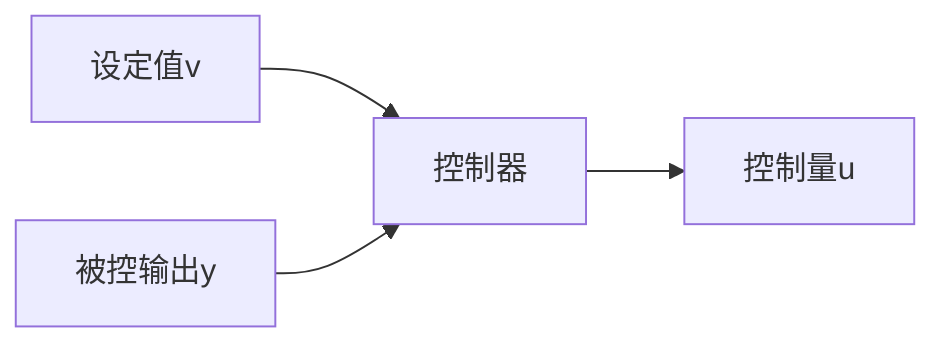

| x | y (Top) | y (Bottom) |
| --- | --- | --- |
| 0 | 0.5 | - |
| 2 | 1.0 | - |
| 4 | 1.0 | - |
| 6 | 1.0 | - |
| 8 | 1.0 | - |
| 10 | 1.0 | - |
| 12 | 1.0 | - |
| 14 | 1.0 | - |
| 16 | 1.0 | - |
| 18 | 1.0 | - |
| 20 | 1.0 | - |

图5.1.9

(3) 采用非线性组合

$$u = - \operatorname{fhan} \left(e _ {1}, c e _ {2}, r _ {2}, h _ {2}\right)$$

时，调整出参数 $c, r_2, h_2$ ，得

$$c = 1, r _ {2} = 3 0, h _ {2} = 0. 0 8$$

对应的仿真结果如图 5.1.10 所示.

在第三个组合方式中没有用到误差积分信息. 说明即使在经典 PID 框架中适当采用非线性组合也是可以不用误差积分反馈的,从而可以避免误差积分反馈的副作用.

line

| x | y |
| --- | --- |
| 0 | 0.0 |
| 2 | 0.5 |
| 4 | 0.75 |
| 6 | 0.9 |
| 8 | 0.95 |
| 10 | 0.98 |
| 12 | 0.99 |
| 14 | 0.98 |
| 16 | 0.95 |
| 18 | 0.9 |
| 20 | 0.85 |

图 5.1.10

以上讨论的是保留经典 PID 原始框架,采用安排过渡过程、合理提取微分信号及合适的组合方式来改造出新型 PID 控制器的基本办法.

这些控制器的信息流的基本框架如图 5.1.11 所示.

flowchart

图 5.1.11

上述控制器都是以系统设定值与系统被控输出为其输入、输出控制量的装置.

下一节将介绍具有“自抗扰”能力的全新的实用控制器——各种“自抗扰控制器”.
