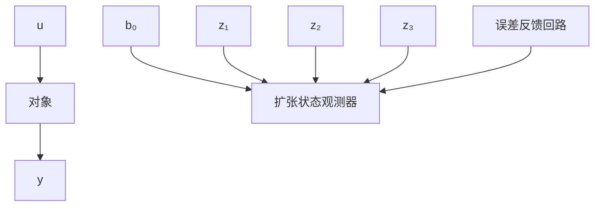

# 5.2 自抗扰控制器

前一节讨论的是对经典PID框架中引入“安排过渡过程”和合理“提取微分信号”的手法及采用误差信号的“适当组合方式”来改善控制器功能和闭环系统品质的问题。本节将讨论用“扩张状态观测器”对扰动进行实时估计与补偿来构造出具有“自抗扰功能”的新型实用控制器的办法，并考察它们对闭环系统品质的影响。

具有“扰动估计补偿”功能的控制器是由如下几个部分所组成：

（1）安排过渡过程．根据设定值 v 安排过渡过程 $v_{1}$ 并提取其微分信号 $v_{2}$ .  
(2) 根据对象的输出和输入信号 y, u 估计出对象的状态 $x_{1}, x_{2}$ 和作用于对象的总和扰动 $x_{3}$ .  
（3）状态误差的非线性反馈律．系统的状态误差是指 $e_{1}=v_{1}-z_{1},e_{2}=v_{2}-z_{2}$ ，误差反馈律是根据误差 $e_{1},e_{2}$ 来决定的控制纯积分器串联型对象的控制规律 $u_{0}$ .  
(4) 对误差反馈控制量 $u_{0}$ 用扰动估计值 $z_{3}$ 的补偿来决定最终控制量.

$$u = u _ {0} - \frac {z _ {3}}{b _ {0}} \text {或} u = \frac {u _ {0} - z _ {3}}{b _ {0}}$$

这里，参数 $b_{0}$ 是决定补偿强弱的“补偿因子”，作为可调参数来用（图5.2.1）.

flowchart

图5.2.1

下面主要考察如下形式的误差反馈律

(1) $u_{0}=\beta_{1}e_{1}+\beta_{2}e_{2}$   
(2) $u_{0}=\beta_{1}\mathrm{fal}(e_{1},\alpha_{1},\delta)+\beta_{2}\mathrm{fal}(e_{2},\alpha_{2},\delta),0<\alpha_{1}<1<\alpha_{2}$   
(3) $u_{0}=-\mathrm{f}\mathrm{h}\mathrm{a}\mathrm{n}(e_{1},e_{2},r,h_{1})$

(4) $u_{0}=-\mathrm{f}\mathrm{h}\mathrm{a}\mathrm{n}(e_{1},ce_{2}e_{2},r,h_{1})$ (5.2.1)

其中, 函数fal, 函数fhan的形式已在前面给出过. 当然还可以用其他形式的非线性组合.

由以上过渡过程的安排，扩张状态观测器，状态误差的反馈形式，扰动估计的补偿四个部分组合而成的控制器称为自抗扰控制器。自抗扰特性指的是实时估计扰动的功能及补偿的功能。扰动的估计补偿能力就是抗干扰功能。这个功能是自抗扰控制器的最本质的功能，因此具有这两个功能的控制器都可以称作自抗扰控制器。实际上，在这两个功能中最重要的还是“实时跟踪估计扰动”的功能。有了实时跟踪估计的结果才有可能进行补偿。

实时跟踪估计扰动可以有各种不同的具体办法，但对控制器设计中引入“实时跟踪估计扰动环节”本身有很重要的意义。某种意义上讲，控制器设计问题其本质就是采用什么样的措施来抑制各种扰动作用的问题。由于反馈本身具有抑制扰动的一定能力，在系统设计中，很多人致力于加强反馈的扰动抑制能力上下功夫来间接地改善控制器性能，所谓灵敏度分析方法的主要研究目的就在于此。

直接处理扰动来抑制其影响，历史上曾出现过两种办法：①苏联学者希巴诺夫在20世纪40年代提出的“绝对不变性原理”；②加拿大学者代维申和温纳模在20世纪年代提出的“内模原理”。它们都是直接认知扰动作用为基础的办法，如“绝对不变性原理”要求能直接测量外扰作用。设计控制器时必须遵守同时含有反馈稳定通道和扰动补偿通道的“双通道原理”。控制器设计中常用的前馈补偿办法就来源于此。“内模原理”则要求事先知道外扰作用的“模型”。设计控制器时必须要把扰动模型嵌入到控制器中。把积分反馈嵌入控制器中来消除常值扰动作用是内模原理的具体体现。但是这里引入的“实时跟踪估计扰动”的“扩张状态观测器”办法却是不用事先知道关于扰动本身的任何先验知识，只要其作用能够影响系统输出且其作用范围是有限的，就可以用扩张状态观测器来实时跟踪估计其作用，从而可以用补偿的办法消除其影响。
