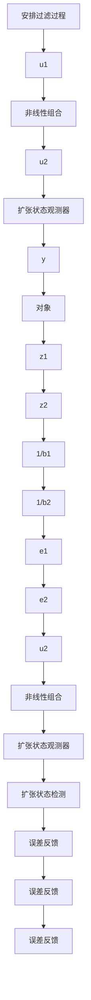
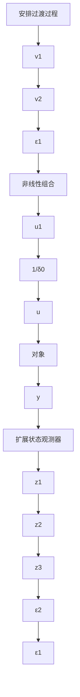

关于扰动抑制问题,如果作用于系统的某一种扰动影响不了系统被控输出,那么对被控输出的控制来说,这种扰动是用不着去抑制的,需要抑制的是能够影响被控输出的扰动作用,即能影响被控输出的扰动,或由被控输出能观的那种扰动.由于从被控输出能观,在被控输出信号中必定包含关于扰动的信息,因此必能从被控输出提炼出系统的扰动作用.这就是“扩张状态观测器”能够实时估计系统扰动作用的根本机理.

具有扰动跟踪补偿能力的自抗扰控制器的完整的算法为：

(1) 以设定值 $v_{0}$ 为输入, 安排过渡过程

$$
\left\{ \begin{array}{l} e = v _ {1} - v _ {0} \\ \mathrm{fh} = \mathrm{fhan} (e, v _ {2}, r _ {0}, h) \\ v _ {1} = v _ {1} + h v _ {2} \\ v _ {2} = v _ {2} + h \mathrm{fh} \end{array} \right. \tag {5.2.2}
$$

(2) 以系统输出 y 和输入 u 来跟踪估计系统状态和扰动

$$
\left\{ \begin{array}{l} e = z _ {1} - y, \mathrm{fe} = \operatorname{fal} (e, 0. 5, \delta), \mathrm{fe} _ {1} = \operatorname{fal} (e, 0. 2 5, \delta) \\ z _ {1} = z _ {1} + h \left(z _ {2} - \beta_ {0 1} e\right) \\ z _ {2} = z _ {2} + h \left(z _ {3} - \beta_ {0 2} \mathrm{fe} + b _ {0} u\right) \\ z _ {3} = z _ {3} + h \left(- \beta_ {0 3} \mathrm{fe} _ {1}\right) \end{array} \right. \tag {5.2.3}
$$

式中， $\beta_{01},\beta_{02},\beta_{03}$ 为一组参数.

(3) 状态误差反馈律

$$
\left\{ \begin{array}{l} e _ {1} = v _ {1} - z _ {1}, e _ {2} = v _ {2} - z _ {2} \\ u _ {0} = k (e _ {1}, e _ {2}, p) \end{array} \right. \tag {5.2.4}
$$

式中，p 为一组参数。

(4) 扰动补偿过程

$$u = u _ {0} - \frac {z _ {3} (t)}{b _ {0}} \text {或} u = \frac {u _ {0} - z _ {3} (t)}{b _ {0}} \tag {5.2.5}$$

自抗扰控制器的结构图为图 5.2.2.

flowchart

图 5.2.2

或者稍加改动上述框图, 得图 5.2.3.

flowchart

图5.2.3

在图5.2.3中点线所框的部分为自抗扰控制器。如果作用于对象的加速度中有已建模的确知部分 $f_{0}(x_{1},x_{2})$ ，那么扩张状态观测器中放入 $f_{0}(z_{1},z_{2})$ ，然后对结构图里补充一个函数 $f_{0}(z_{1},z_{2})$ 的发生器成图5.2.4（或图5.2.5）形式。

相应的算法为

