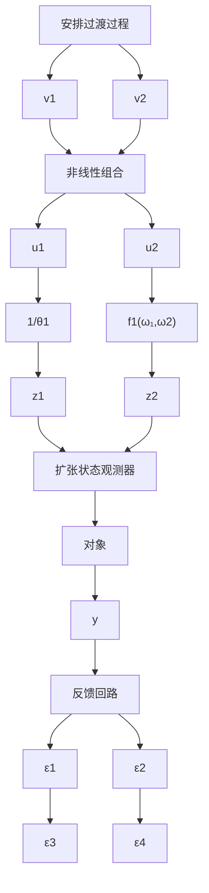
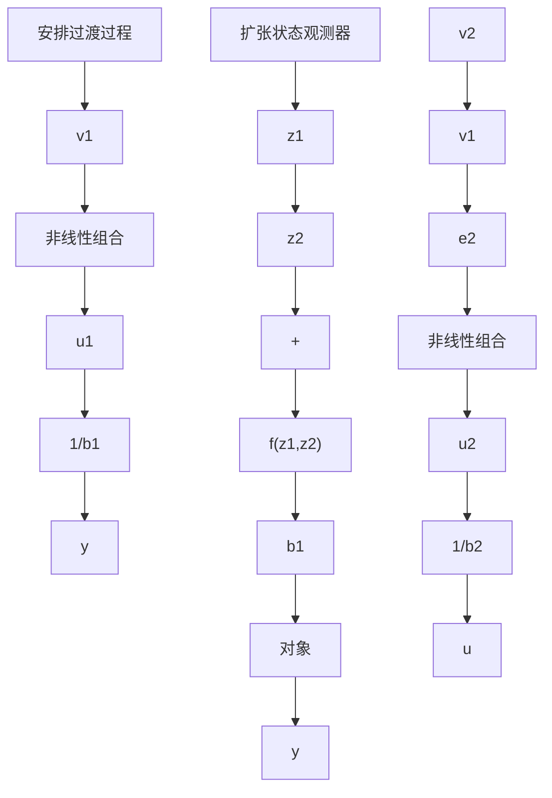
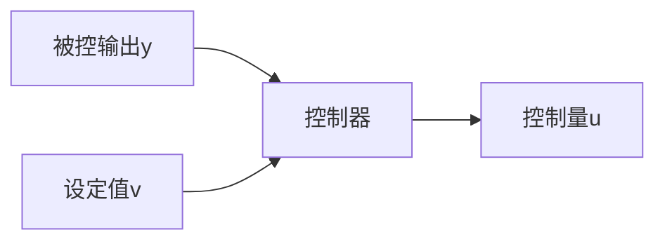

flowchart

图5.2.4  

flowchart

图5.2.5

$$
\left\{ \begin{array}{l} \mathrm{fh} = \mathrm{fhan} (v _ {1} - v, v _ {2}, r _ {0}, h) \\ v _ {1} = v _ {1} + h v _ {2} \\ v _ {2} = v _ {2} + h \mathrm{fh} \end{array} \right. \tag {5.2.6}

\left\{ \begin{array}{l} e = z _ {1} - y, \mathrm{fe} = \operatorname{fal} (e, 0. 5, h), \mathrm{fe} _ {1} = \operatorname{fal} (e, 0. 2 5, h) \\ z _ {1} = z _ {1} + h \left(z _ {2} - \beta_ {0 1} e\right) \\ z _ {2} = z _ {2} + h \left(f _ {0} \left(z _ {1}, z _ {2}\right) + z _ {3} - \beta_ {0 1} \mathrm{fe} + b _ {0} u\right) \\ z _ {3} = z _ {3} + h \left(- \beta_ {0 3} \mathrm{fe} _ {1}\right) \end{array} \right. \tag {5.2.7}

\left\{ \begin{array}{l} e _ {1} = v _ {1} - z _ {1}, e _ {2} = v _ {2} - z _ {2} \\ u _ {0} = k (e _ {1}, e _ {2}, p) \end{array} \right.
u = u _ {0} - \frac {f _ {0} (z _ {1} , z _ {2}) + z _ {3} (t)}{b _ {0}} \tag {5.2.8}
$$

或

$$
\left\{ \begin{array}{l} \mathrm{fh} = \mathrm{fhan} (v _ {1} - v, v _ {2}, r _ {0}, h) \\ v _ {1} = v _ {1} + h v _ {2} \\ v _ {2} = v _ {2} + h \mathrm{fh} \end{array} \right. \tag {5.2.9}

\left\{ \begin{array}{l} e = z _ {1} - y, \mathrm{fe} = \operatorname{fal} (e, 0. 5, h), \mathrm{fe} _ {1} = \operatorname{fal} (e, 0. 2 5, h) \\ z _ {1} = z _ {1} + h \left(z _ {2} - \beta_ {0 1} e\right) \\ z _ {2} = z _ {2} + h \left(f _ {0} \left(z _ {1}, z _ {2}\right) + z _ {3} - \beta_ {0 1} \mathrm{fe} + b _ {0} u\right) \\ z _ {3} = z _ {3} + h \left(- \beta_ {0 3} \mathrm{fe} _ {1}\right) \end{array} \right. \tag {5.2.10}

\left\{ \begin{array}{l} e _ {1} = v _ {1} - z _ {1}, e _ {2} = v _ {2} - z _ {2} \\ u _ {0} = k (e _ {1}, e _ {2}, p) \end{array} \right.
u = \frac {u _ {0} - f _ {0} (z _ {1} , z _ {2}) - z _ {3} (t)}{b _ {0}} \tag {5.2.11}
$$

式中， $p$ 为一组参数。函数 $k(e_1, e_2, p)$ 的具体形式，除式(5.2.1)给出的形式外，还可以有各种不同的取法。

这些自抗扰控制器信息流的基本框架如图 5.2.6 所示.

flowchart

图5.2.6

自抗扰控制器是以系统设定值v、系统被控输出y和上一步算出的控制量为其输入确定出新的控制量 u 的装置。这里和上一节的信息流框图图 5.1.11 不同的是多了一个控制量的返回通道，正是这个通道的增添才有可能实现控制器的“自抗扰”能力。
