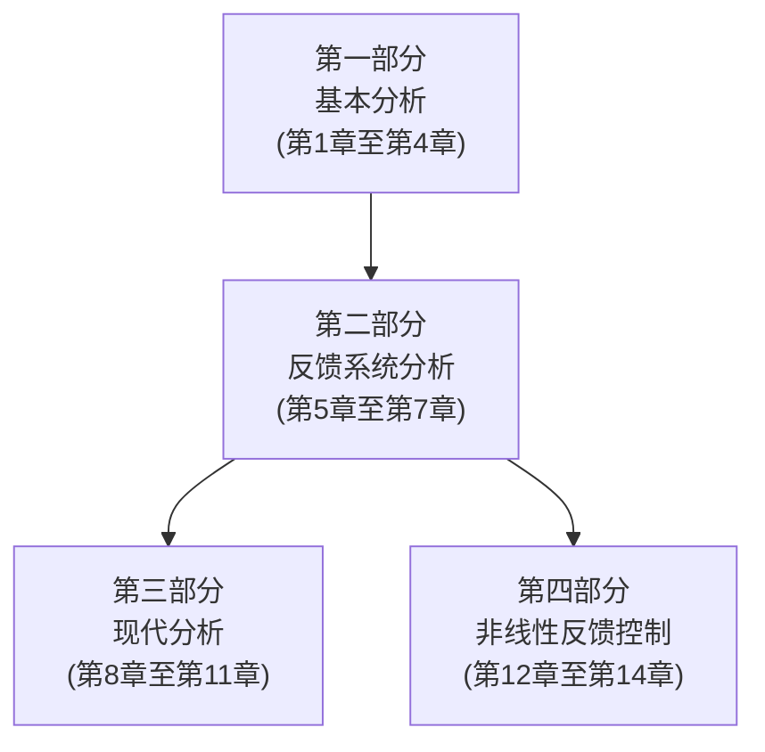

# 前言

本书是为研究生一年级的非线性系统或控制课程编写的 $^{①}$ ，也可以作为工程技术人员或应用数学研究人员的参考书。它是作者在密歇根州立大学多年执教非线性系统课程的结晶。学习这门课程的学生应具备电子工程、机械工程或应用数学的基础知识，这门课的先修课程是以与Antsaklis and Michel[9]，Chen[35]，Kailath[94]或Rugh[158]同等水平的教材讲授的线性系统研究生层次课程。如果学生具备了线性系统的知识，就不必为引入“状态”一词而担心学生难于理解，也就可以自由引用“传递函数”、“状态转移矩阵”和其他一些线性系统的概念。此外，学生还应具备任何工程或数学专业的研究生应有的一般数学基础，如微积分、微分方程和矩阵理论等。附录中汇集了一些书中用到的数学知识。

本书在写作中按章循序渐进地插入了数学内容,因此第2章是基础知识。实际上这一章可以在本科高年级学习,即使在低年级学习也没有困难,这也是把李雅普诺夫稳定性分为两部分讨论的原因。在4.1节到4.3节,引入了自治系统李雅普诺夫稳定性的实质,在这里不必担心一致性和K类函数等术语的学术性。在4.4节到4.6节以更适用于非自治系统的一般方式提出了李雅普诺夫稳定性问题,并允许进一步研究现代稳定性理论。第4章末引入的数学内容是为了让学生能顺利地学习其余内容。

附录中给出了一些较高水平的数学公式的证明,这些证明不必在课堂上讲授。把这些内容加进来一方面是因为课程内容本身的需要,另一方面是考虑到一些学生需要或希望学习这部分内容,例如要继续研究非线性系统或控制理论的博士生等,这些学生可以以自学的方式继续学习附录中的内容。

本书出版第三版的主要目的在于：

1. 使本书(特别是前面的章节)更适合一年级的研究生使用。以第3章所做的改动为例，将所有有关数学背景的内容、收缩映射定理、存在性及唯一性定理的证明都归入附录，而其他内容与第二版相比可读性更强。

2. 重新组织内容结构,使构造非线性系统或其控制过程更容易。从结构上看,本书可以分为四部分,如下页图所示。第一部分、第二部分和第三部分主要是非线性系统的分析过程,而第一部分、第二部分和第四部分的内容主要是非线性控制过程。

3. 更新第二版的内容,包括了一些近年来在非线性控制中证明是有用的观点或成果。第三版的新意在于:扩充了无源和基于无源的控制、滑模控制和高增益观测器的内容,此外还在二阶系统中引入了分岔。在学术方面,读者会看到在第10章和第11章中 Kurzweil 的逆李雅普诺夫定理,以及有关积分控制和增益定序法的新成果。

4. 更新了习题。第三版新增了170多道习题。

flowchart

在本书的写作过程中,我得到了许多同事、学生和读者的支持。他们通过讨论、建议、更正以及一些建设性的意见和对前两版的反馈为我提供了极大的帮助。要答谢的人实在太多,想把他们的名字一一列出,又恐挂一漏万,谨在此向曾帮助过我的每一个人表示深深的谢意。

我还要特别感谢为我提供写作环境的密歇根州立大学,以及支持我研究非线性反馈控制的美国国家科学基金。

书中的所有计算,包括微分方程的数值解,都是用 MATLAB 和 Simulink 完成的,插图用 MATLAB 或 LATEX 绘图工具生成。

我很希望本书尽善尽美,但错误之处在所难免,如发现错误请发邮件给 khalil@msu.edu,本人将不胜感激。

本书配套网站为

www.prenhall.com/khalil/

其中包括本书最新勘误表①、补充的习题以及其他一些相关内容。

Hassan K. Khalil
