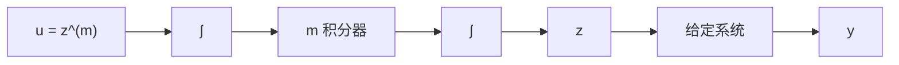

# 1.1 描述大量物理非线性系统的数学模型是 $n$ 阶微分方程

$$y ^ {(n)} = g (t, y, \dot {y}, \dots , y ^ {(n - 1)}, u)$$

其中 u 和 y 都是标量变量。以 u 作为输入，y 作为输出，求状态模型。

1.2 考虑由 $n$ 阶微分方程

$$y ^ {(n)} = g _ {1} \left(t, y, \dot {y}, \dots , y ^ {(n - 1)}, u\right) + g _ {2} \left(t, y, \dot {y}, \dots , y ^ {(n - 2)}\right) \dot {u}$$

描述的单输入-单输出系统, $g_{2}$ 是其自变量的可微函数。以 u 作为输入,y 作为输出,求状态模型。

提示: 取 $x_{n}=y^{(n-1)}-g_{2}(t,y,\dot{y},\cdots,y^{(n-2)})u$ 。

1.3 考虑由 $n$ 阶微分方程

$$y ^ {(n)} = g \left(y, \dots , y ^ {(n - 1)}, z, \dots , z ^ {(m)}\right), \quad m < n$$

描述的单输入-单输出系统,z 是输入,y 是输出。通过在输入端添加 m 个串联的积分器扩展系统的动态范围,并定义 $u = z^{(m)}$ 作为扩展系统的输入,如图 1.17 所示。用 $y, \cdots, y^{(n-1)}$ 和 $z, \cdots, z^{(m-1)}$ 作为状态变量,求扩展系统的状态模型。

flowchart

图1.17 习题1.3

1.4 一个 $m$ 连杆机器人的非线性动力学问题[171,185]可表示为

$$M (q) \ddot {q} + C (q, \dot {q}) \dot {q} + D \dot {q} + g (q) = u$$

其中 q 是 m 维广义坐标向量, 表示结合位置, u 是 m 维控制(转动力矩)输入, $M(q)$ 是对称惯性矩阵, 对于所有 $q \in R^{m}$ 都是正定的。 $C(q, \dot{q}) \dot{q}$ 用于说明离心力和科里奥利(Coriolis)力。对于所有 $q, \dot{q} \in R^{m}$ , 矩阵 C 满足 $\dot{M} - 2C$ 是斜对称矩阵, 其中 $\dot{M}$ 是 $M(q)$ 对于 t 的全微分。Dq 用于说明黏滞阻尼, D 是半正定对称矩阵。 $g(q)$ 表示重力, 由 $g(q) = [\partial P(q)/\partial q]^{\mathrm{T}}$ 给出, 其中 $P(q)$ 是由于重力产生的所有连杆的全部势能。选择适当的状态变量, 求出状态方程。

1.5 有一个具有软连接的单链路控制机 $^{[185]}$ ，当忽略阻尼时，其非线性动力学方程由下式给出：

$$I \ddot {q} _ {1} + M g L \sin q _ {1} + k (q _ {1} - q _ {2}) = 0J \ddot {q} _ {2} - k (q _ {1} - q _ {2}) = u$$

其中 $q_{1}$ 和 $q_{2}$ 是角位置, I 和 J 是转动惯量, k 是弹簧系数, M 是总质量, L 是距离, u 是转动力矩输入。为该系统选择状态变量, 并写出状态方程。

1.6 一个具有软连接的 $m$ 连杆机器人[185]的非线性动力学方程为：

$$M \left(q _ {1}\right) \ddot {q} _ {1} + h \left(q _ {1}, \dot {q} _ {1}\right) + K \left(q _ {1} - q _ {2}\right) = 0J \ddot {q} _ {2} - K (q _ {1} - q _ {2}) = u$$

其中 $q_{1}$ 和 $q_{2}$ 是 m 维广义坐标向量， $M(q_{1})$ 和 J 是对称非奇异惯性矩阵，u 是 m 维控制输入， $h(q,\dot{q})$ 表示离心力、科里奥利力和重力，K 是联合（joint）弹簧系数的对角矩阵。为该系统选择状态变量，并写出状态方程。

1.7 图 1.18 所示为两个系统的反馈连接，传递函数 $G(s)$ 表示的是一个线性时不变系统， $z = \psi(t, y)$ 定义了一个非线性时变部件。变量 r, u, y 和 z 是维数相同的向量， $\psi(t, y)$ 是向量值函数。以 r 作为输入，y 作为输出，求状态模型。

1.8 一个与无限长总线(infinite bus)连接的同步发电机由下式表示 $^{[148]}$ ：

flowchart

