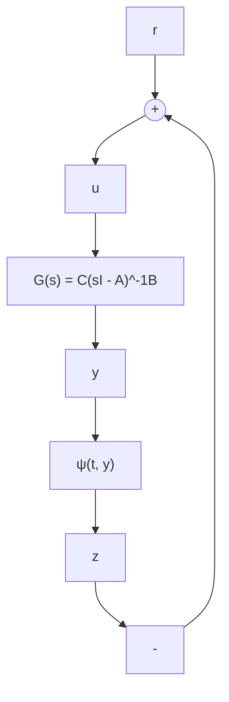
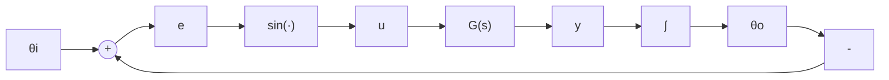

图1.18 习题1.7

$$
\begin{array}{l} M \ddot {\delta} = P - D \dot {\delta} - \eta_ {1} E _ {q} \sin \delta \\ \tau \dot {E} _ {q} = - \eta_ {2} E _ {q} + \eta_ {3} \cos \delta + E _ {F D} \\ \end{array}
$$

其中 $\delta$ 是用弧度表示的角度, $E_{q}$ 是电压,P 是机械输入功率, $E_{FD}$ 是场电压(输入),D 是阻尼系数,M 是惯性系数, $\tau$ 是时间常数, $\eta_{1},\eta_{2}$ 和 $\eta_{3}$ 是常数参数。

(a) 用 $\delta, \dot{\delta}$ 和 $E_{a}$ 作为状态变量, 写出状态方程。  
(b) 设 P=0.815, $E_{FD}=1.22$ , $\eta_{1}=2.0$ , $\eta_{2}=2.7$ , $\eta_{3}=1.7$ , $\tau=6.6$ , M=0.0147, D/M=4, 求出所有平衡点。  
(c) 假设 $\tau$ 比较大, 使 $\dot{E}_{a} \approx 0$ 。证明假设 $E_{a}$ 为常数, 可简化为单摆方程。

1.9 图 1.19 所示的电路中含有一个非线性电感, 电路由与时间相关的电流源驱动。假设非线性电感是约瑟夫森结 $^{[39]}$ , 其特性为 $i_{L}=I_{0}\sin k\phi_{L}$ , 其中 $\phi_{L}$ 是电感的磁通量, $I_{0}$ 和 k 是常数。

(a) 用 $\phi_{L}$ 和 $v_{C}$ 作为状态变量, 求状态方程。

text_image

i_s(t)
R
+
-
v_C
C
+
-
v_L
i_L

图1.19 习题1.9和习题1.10

(b) 选择 $i_{L}$ 和 $v_{C}$ 作为状态变量会更容易吗？

1.10 图 1.19 所示的电路中含有一个非线性电感, 电路由与时间相关的电流源驱动。假设非线性电感的特性为 $i_{L}=L\phi_{L}+\mu\phi_{L}^{3}$ , 其中 $\phi_{L}$ 是电感的磁通量, L 和 $\mu$ 是正常数。

(a) 用 $\phi_{L}$ 和 $v_{C}$ 作为状态变量,求状态方程。  
(b) 当 $i_{s}=0$ 时, 求所有平衡点。

1.11 锁相环 $^{[64]}$ 可由图 1.20 的方框图表示。设 $\{A, B, C\}$ 是标量，是严格正则传递函数（strictly proper transfer function） $G(s)$ 的一个最小实现。假设 A 的所有特征值都具有负实部， $G(0) \neq 0$ ，且 $\theta_{i}$ 为常数。设 z 是 $\{A, B, C\}$ 实现的状态。

(a) 证明该闭环系统可由如下状态方程表示:

$$\dot {z} = A z + B \sin e, \quad \dot {e} = - C z$$

(b) 求系统的所有平衡点。  
(c) 证明当 $G(s)=1/(\tau s+1)$ 时,该闭环模型与单摆方程的模型一致。

1.12 考虑图 1.21 所示的质量-弹簧系统, 假设弹簧是线性的, 非线性黏滞阻尼由 $c_{1}\dot{y} + c_{2}\dot{y} \mid \dot{y} \mid$ 描述。求描述系统运动的状态方程。

flowchart

图1.20 习题1.11

text_image

m
y

图1.21 习题1.12
