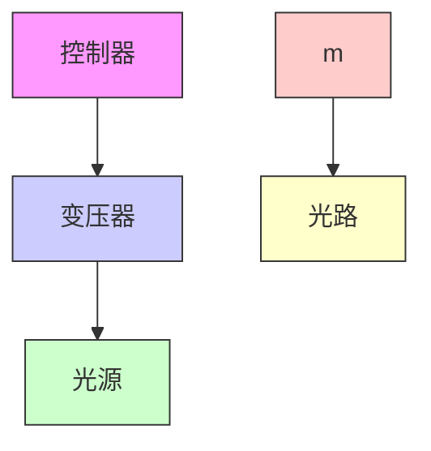

(a) 对于他励直流电机, 电压 $v_{a}$ 和 $v_{f}$ 是独立控制输入。选择适当的状态变量, 求状态方程。  
(b) 只讨论(a)中场控直流电机的状态方程, 其中 $v_{f}$ 是控制输入, $v_{a}$ 保持常数。  
(c) 只讨论(a)中电枢控制的直流电机的状态方程, 其中 $v_{a}$ 是控制输入, $v_{f}$ 保持常数, 能降低这种情况下模型的阶数吗?  
(d) 对于并励直流电机, 励磁绕组与电枢绕组并联, 且在励磁绕组中串联一个电阻 $R_{x}$ 以限制磁通量, 即 $v = v_{a} = v_{f} + R_{x} i_{f}$ 。以 v 作为控制输入, 写出状态方程。

1.18 图 1.26 为一个磁悬浮系统的示意图,一个磁性小球通过电磁体处于悬浮状态,电磁体的电流由小球位置测得的反馈光控制可参阅文献[211]的 192 页至 200 页。该系统是构造悬浮物体的基本组成部分,用于陀螺仪、加速计和快速列车中。小球的运动方程为

$$m \ddot {y} = - k \dot {y} + m g + F (y, i)$$

其中， $m$ 是小球的质量， $y\geqslant 0$ 是小球距参考点 $y = 0$ （小球在线圈旁的位置）的垂直距离(向下), k 是黏滞摩擦系数, g 是重力加速度, $F(y, i)$ 是电磁体产生的力, 电磁体的电感与小球的位置有关, 可用模型

$$L (y) = L _ {1} + \frac {L _ {0}}{1 + y / a}$$

表示,其中 $L_{1}, L_{0}$ 和 a 是正常数。该模型表示电感具有最大值时的情况,此时小球在线圈旁,当小球移动至 $y = \infty$ 时,其值为一个常数。 $E(y, i) = \frac{1}{2} L(y) i^{2}$ 为电磁体中存储的能量,则力 $F(y, i)$ 由下式给出:

$$F (y, i) = \frac {\partial E}{\partial y} = - \frac {L _ {0} i ^ {2}}{2 a (1 + y / a) ^ {2}}$$

当线圈电路由电压为 v 的电压源驱动时,由基尔霍夫电压定律可得关系式 $v = \dot{\phi} + Ri, R$ 是电路中串联的电阻, $\phi = L(y)i$ 是磁通匝链数。

(a) 用 $x_{1}=y, x_{2}=\dot{y}$ 和 $x_{3}=i$ 作为状态变量, u=v 作为控制输入, 求状态方程。  
(b) 假设在某一位置 r>0 小球达到理想平衡。分别求保持平衡时 i 和 v 的稳态值 $I_{ss}$ 和 $V_{ss}$ 。

下面三个习题是流体系统的例子 $^{[41]}$ 。

1.19 在图 1.27 所示的流体系统中, 液体贮存于一个开口水槽内。h 是液体表面距槽底的高度, $A(h)$ 是水槽的横截面积, 它是 h 的函数。液体体积 $v = \int_{0}^{h} A(\lambda) d\lambda$ 。对于密度为 $\rho$ 的液体, 其绝对压强为 $p = \rho gh + p_{a}, p_{a}$ 是大气压强 (假设为常数), g 是重力加速度。液体流入水槽的流速为 $w_{i}$ , 通过阀门流出水槽的流速服从流压关系, 用 $w_{o} = k \sqrt{\Delta p}$ 表示。在流动情况下, $\Delta p = p - p_{a}$ 。取 $u = w_{i}$ 作为控制输入, y = h 作为输出。

(a) 用 h 作为状态变量, 确定状态模型。  
(b) 用 $p - p_{a}$ 作为状态变量, 确定状态模型。  
(c) 求保持输出为恒定值 r 所需的 $u_{ss}$ 。

flowchart

图 1.26 习题 1.18 的磁悬浮系统

text_image

wi
pa
h
p
k
wo
+Δp-
pa

图1.27 习题1.19
